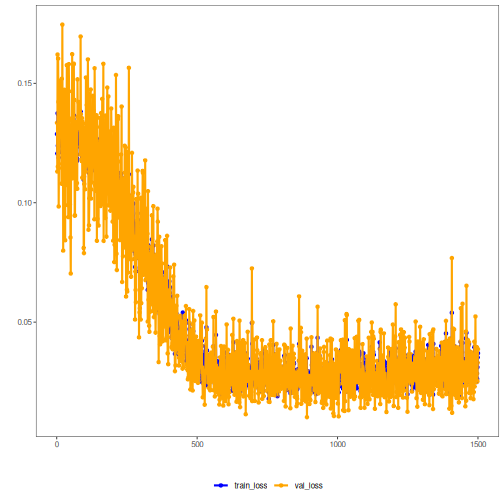

``` r
# Adversarial Autoencoder transformation (encode-decode)

# Considering a dataset with $p$ numerical attributes. 

# The goal of the autoencoder is to reduce the dimension of $p$ to $k$, such that these $k$ attributes are enough to recompose the original $p$ attributes. However from the $k$ dimensionals the data is returned back to $p$ dimensions. The higher the quality of autoencoder the similiar is the output from the input. 

# installing packages

install.packages("tspredit")
```

```

```

``` r
install.packages("daltoolboxdp")
```

```

```


``` r
# loading DAL
library(daltoolbox)
library(tspredit)
library(daltoolboxdp)
library(ggplot2)
```


``` r
# dataset for example 

data(sin_data)

sw_size <- 5
ts <- ts_data(sin_data$y, sw_size)

ts_head(ts)
```

```
##             t4        t3        t2        t1        t0
## [1,] 0.0000000 0.2474040 0.4794255 0.6816388 0.8414710
## [2,] 0.2474040 0.4794255 0.6816388 0.8414710 0.9489846
## [3,] 0.4794255 0.6816388 0.8414710 0.9489846 0.9974950
## [4,] 0.6816388 0.8414710 0.9489846 0.9974950 0.9839859
## [5,] 0.8414710 0.9489846 0.9974950 0.9839859 0.9092974
## [6,] 0.9489846 0.9974950 0.9839859 0.9092974 0.7780732
```


``` r
# applying data normalization

preproc <- ts_norm_gminmax()
preproc <- fit(preproc, ts)
ts <- transform(preproc, ts)

ts_head(ts)
```

```
##             t4        t3        t2        t1        t0
## [1,] 0.5004502 0.6243512 0.7405486 0.8418178 0.9218625
## [2,] 0.6243512 0.7405486 0.8418178 0.9218625 0.9757058
## [3,] 0.7405486 0.8418178 0.9218625 0.9757058 1.0000000
## [4,] 0.8418178 0.9218625 0.9757058 1.0000000 0.9932346
## [5,] 0.9218625 0.9757058 1.0000000 0.9932346 0.9558303
## [6,] 0.9757058 1.0000000 0.9932346 0.9558303 0.8901126
```


``` r
# spliting into training and test

samp <- ts_sample(ts, test_size = 10)
train <- as.data.frame(samp$train)
test <- as.data.frame(samp$test)
```


``` r
# creating autoencoder - reduce from 5 to 3 dimensions

auto <- autoenc_adv_ed(5, 3, batch_size=3, num_epochs=1500)

auto <- fit(auto, train)
```


``` r
fit_loss <- data.frame(x=1:length(auto$train_loss), train_loss=auto$train_loss,val_loss=auto$val_loss)

grf <- plot_series(fit_loss, colors=c('Blue','Orange'))
plot(grf)
```




``` r
# testing autoencoder
# presenting the original test set and display encoding

print(head(test))
```

```
##          t4        t3        t2        t1        t0
## 1 0.7258342 0.8294719 0.9126527 0.9702046 0.9985496
## 2 0.8294719 0.9126527 0.9702046 0.9985496 0.9959251
## 3 0.9126527 0.9702046 0.9985496 0.9959251 0.9624944
## 4 0.9702046 0.9985496 0.9959251 0.9624944 0.9003360
## 5 0.9985496 0.9959251 0.9624944 0.9003360 0.8133146
## 6 0.9959251 0.9624944 0.9003360 0.8133146 0.7068409
```

``` r
result <- transform(auto, test)
print(head(result))
```

```
##           [,1]      [,2]      [,3]      [,4]      [,5]
## [1,] 0.8507615 0.9047461 0.9269681 0.9283249 0.8903667
## [2,] 0.8785219 0.9287027 0.9476514 0.9492889 0.9147121
## [3,] 0.8902379 0.9381627 0.9555071 0.9571744 0.9246168
## [4,] 0.8880826 0.9364696 0.9540736 0.9557403 0.9228098
## [5,] 0.8711662 0.9226007 0.9423527 0.9439445 0.9083572
## [6,] 0.8370894 0.8922108 0.9155378 0.9166123 0.8779758
```


``` r
result <- as.data.frame(result)
names(result) <- names(test)
r2 <- c()
mape <- c()
for (col in names(test)){
r2_col <- cor(test[col], result[col])^2
r2 <- append(r2, r2_col)
mape_col <- mean((abs((result[col] - test[col]))/test[col])[[col]])
mape <- append(mape, mape_col)
print(paste(col, 'R2 test:', r2_col, 'MAPE:', mape_col))
}
```

```
## [1] "t4 R2 test: 0.328651144664241 MAPE: 0.170410833002697"
## [1] "t3 R2 test: 0.888238261576987 MAPE: 0.0928201653123395"
## [1] "t2 R2 test: 0.960120914529003 MAPE: 0.0430940958403788"
## [1] "t1 R2 test: 0.90678012438816 MAPE: 0.140659044327508"
## [1] "t0 R2 test: 0.847402227738542 MAPE: 0.329941038976661"
```

``` r
print(paste('Means R2 test:', mean(r2), 'MAPE:', mean(mape)))
```

```
## [1] "Means R2 test: 0.786238534579387 MAPE: 0.155385035491917"
```

