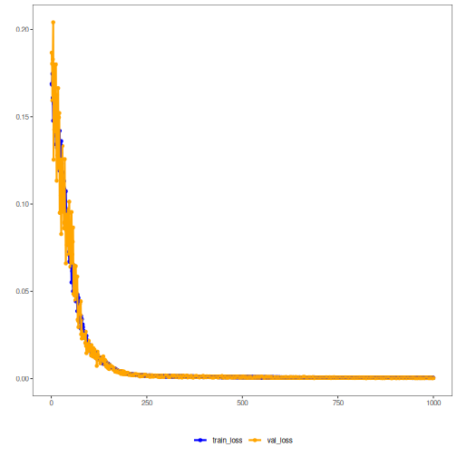

## Autoencoder Convolucional (encode)

Este exemplo demonstra como usar um autoencoder convolucional 1D para codificar janelas de uma série temporal, reduzindo de p para k dimensões e preservando informação relevante.

Pré‑requisitos
- Python com PyTorch acessível via reticulate
- Pacotes R: daltoolbox, tspredit, daltoolboxdp, ggplot2
 
 Notas rápidas
 - Arquitetura: camadas Conv1D no encoder/decoder para capturar padrões locais na janela.
 - Indicado quando há estruturas locais (tendências curtas, padrões repetitivos) na janela.

``` r
# Convolutional Autoencoder transformation (encode)

# Considering a dataset with $p$ numerical attributes. 

# The goal of the autoencoder is to reduce the dimension of $p$ to $k$, such that these $k$ attributes are enough to recompose the original $p$ attributes. 

# installing packages

#install.packages("tspredit")
#install.packages("daltoolboxdp")
```


``` r
# Carregando pacotes
library(daltoolbox)
library(tspredit)
library(daltoolboxdp)
library(ggplot2)
```


``` r
# Dataset de exemplo (série -> janelas) 

data(tsd)

sw_size <- 5
ts <- ts_data(tsd$y, sw_size)

ts_head(ts)
```

```
##             t4        t3        t2        t1        t0
## [1,] 0.0000000 0.2474040 0.4794255 0.6816388 0.8414710
## [2,] 0.2474040 0.4794255 0.6816388 0.8414710 0.9489846
## [3,] 0.4794255 0.6816388 0.8414710 0.9489846 0.9974950
## [4,] 0.6816388 0.8414710 0.9489846 0.9974950 0.9839859
## [5,] 0.8414710 0.9489846 0.9974950 0.9839859 0.9092974
## [6,] 0.9489846 0.9974950 0.9839859 0.9092974 0.7780732
```


``` r
# Normalização (min-max por grupo)

preproc <- ts_norm_gminmax()
preproc <- fit(preproc, ts)
ts <- transform(preproc, ts)

ts_head(ts)
```

```
##             t4        t3        t2        t1        t0
## [1,] 0.5004502 0.6243512 0.7405486 0.8418178 0.9218625
## [2,] 0.6243512 0.7405486 0.8418178 0.9218625 0.9757058
## [3,] 0.7405486 0.8418178 0.9218625 0.9757058 1.0000000
## [4,] 0.8418178 0.9218625 0.9757058 1.0000000 0.9932346
## [5,] 0.9218625 0.9757058 1.0000000 0.9932346 0.9558303
## [6,] 0.9757058 1.0000000 0.9932346 0.9558303 0.8901126
```


``` r
# Divisão treino/teste

samp <- ts_sample(ts, test_size = 10)
train <- as.data.frame(samp$train)
test <- as.data.frame(samp$test)
```


``` r
# Treinando autoencoder (reduz 5 -> 3)

auto <- autoenc_conv_e(5, 3)

auto <- fit(auto, train)
```


``` r
fit_loss <- data.frame(x=1:length(auto$train_loss), train_loss=auto$train_loss,val_loss=auto$val_loss)

grf <- plot_series(fit_loss, colors=c('Blue','Orange'))
plot(grf)
```


 

``` r
# As curvas mostram a evolução da perda; quedas estáveis indicam bom aprendizado
```


``` r
# Testando autoencoder
# Apresentando o conjunto de teste e exibindo codificação

print(head(test))
```

```
##          t4        t3        t2        t1        t0
## 1 0.7258342 0.8294719 0.9126527 0.9702046 0.9985496
## 2 0.8294719 0.9126527 0.9702046 0.9985496 0.9959251
## 3 0.9126527 0.9702046 0.9985496 0.9959251 0.9624944
## 4 0.9702046 0.9985496 0.9959251 0.9624944 0.9003360
## 5 0.9985496 0.9959251 0.9624944 0.9003360 0.8133146
## 6 0.9959251 0.9624944 0.9003360 0.8133146 0.7068409
```

``` r
result <- transform(auto, test)
print(head(result))
```

```
##             [,1]       [,2]     [,3]
## [1,] -1.22700810 -0.9831961 1.169764
## [2,] -1.03069568 -1.1428639 1.329685
## [3,] -0.81910223 -1.2539396 1.421351
## [4,] -0.56431830 -1.2991978 1.380158
## [5,] -0.31255794 -1.2778066 1.244296
## [6,] -0.09585384 -1.1735302 1.011502
```

