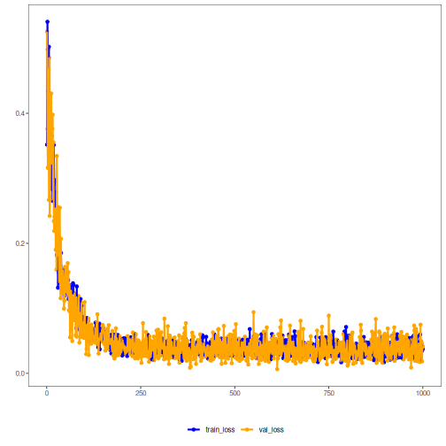

## Autoencoder com Denoising (encode-decode)

Este exemplo demonstra como usar um autoencoder com ruído (denoising) para codificar e reconstruir janelas da série temporal, permitindo avaliar a qualidade da reconstrução sob ruído.

Pré‑requisitos
- Python com PyTorch acessível via reticulate
- Pacotes R: daltoolbox, tspredit, daltoolboxdp, ggplot2
 
 Notas rápidas
 - O ruído é aplicado na entrada durante o treino; na inferência, a reconstrução tende a ser mais suave.
 - Métricas por coluna (R² e MAPE) ajudam a verificar robustez por passo.

``` r
# Denoising Autoencoder transformation (encode-decode)

# Considering a dataset with $p$ numerical attributes. 

# The goal of the autoencoder is to reduce the dimension of $p$ to $k$, such that these $k$ attributes are enough to recompose the original $p$ attributes. However from the $k$ dimensionals the data is returned back to $p$ dimensions. The higher the quality of autoencoder the similiar is the output from the input. 

# installing packages

#install.packages("tspredit")
#install.packages("daltoolboxdp")
```


``` r
# Carregando pacotes
library(daltoolbox)
library(tspredit)
library(daltoolboxdp)
library(ggplot2)
```


``` r
# Dataset de exemplo (série -> janelas) 

data(tsd)

sw_size <- 5
ts <- ts_data(tsd$y, sw_size)

ts_head(ts)
```

```
##             t4        t3        t2        t1        t0
## [1,] 0.0000000 0.2474040 0.4794255 0.6816388 0.8414710
## [2,] 0.2474040 0.4794255 0.6816388 0.8414710 0.9489846
## [3,] 0.4794255 0.6816388 0.8414710 0.9489846 0.9974950
## [4,] 0.6816388 0.8414710 0.9489846 0.9974950 0.9839859
## [5,] 0.8414710 0.9489846 0.9974950 0.9839859 0.9092974
## [6,] 0.9489846 0.9974950 0.9839859 0.9092974 0.7780732
```


``` r
# Normalização (min-max por grupo)

preproc <- ts_norm_gminmax()
preproc <- fit(preproc, ts)
ts <- transform(preproc, ts)

ts_head(ts)
```

```
##             t4        t3        t2        t1        t0
## [1,] 0.5004502 0.6243512 0.7405486 0.8418178 0.9218625
## [2,] 0.6243512 0.7405486 0.8418178 0.9218625 0.9757058
## [3,] 0.7405486 0.8418178 0.9218625 0.9757058 1.0000000
## [4,] 0.8418178 0.9218625 0.9757058 1.0000000 0.9932346
## [5,] 0.9218625 0.9757058 1.0000000 0.9932346 0.9558303
## [6,] 0.9757058 1.0000000 0.9932346 0.9558303 0.8901126
```


``` r
# Divisão treino/teste

samp <- ts_sample(ts, test_size = 10)
train <- as.data.frame(samp$train)
test <- as.data.frame(samp$test)
```


``` r
# Treinando autoencoder (reduz 5 -> 3)

auto <- autoenc_denoise_ed(5, 3)

auto <- fit(auto, train)
```


``` r
fit_loss <- data.frame(x=1:length(auto$train_loss), train_loss=auto$train_loss,val_loss=auto$val_loss)

grf <- plot_series(fit_loss, colors=c('Blue','Orange'))
plot(grf)
```




``` r
# Testando autoencoder
# Apresentando o conjunto de teste e exibindo reconstrução

print(head(test))
```

```
##          t4        t3        t2        t1        t0
## 1 0.7258342 0.8294719 0.9126527 0.9702046 0.9985496
## 2 0.8294719 0.9126527 0.9702046 0.9985496 0.9959251
## 3 0.9126527 0.9702046 0.9985496 0.9959251 0.9624944
## 4 0.9702046 0.9985496 0.9959251 0.9624944 0.9003360
## 5 0.9985496 0.9959251 0.9624944 0.9003360 0.8133146
## 6 0.9959251 0.9624944 0.9003360 0.8133146 0.7068409
```

``` r
result <- transform(auto, test)
print(head(result))
```

```
##           [,1]      [,2]      [,3]      [,4]      [,5]
## [1,] 0.7396999 0.8332940 0.9097936 0.9345015 1.0293039
## [2,] 0.8429305 0.9125763 0.9687915 0.9646028 1.0300387
## [3,] 0.9270367 0.9686274 1.0002644 0.9633082 0.9996707
## [4,] 0.9869005 0.9953306 1.0023001 0.9289137 0.9322840
## [5,] 1.0146942 0.9919669 0.9707832 0.8665791 0.8393714
## [6,] 1.0115509 0.9587041 0.9094107 0.7778739 0.7271910
```


``` r
result <- as.data.frame(result)
names(result) <- names(test)
r2 <- c()
mape <- c()
for (col in names(test)){
  r2_col <- cor(test[col], result[col])^2
  r2 <- append(r2, r2_col)
  mape_col <- mean((abs((result[col] - test[col]))/test[col])[[col]])
  mape <- append(mape, mape_col)
  print(paste(col, 'R2 teste:', r2_col, 'MAPE:', mape_col))
}
```

```
## [1] "t4 R2 teste: 0.999428846495296 MAPE: 0.0144892787032499"
## [1] "t3 R2 teste: 0.999677285827726 MAPE: 0.00308049490259746"
## [1] "t2 R2 teste: 0.998895027450938 MAPE: 0.00941670657819297"
## [1] "t1 R2 teste: 0.999955854921998 MAPE: 0.053086348105404"
## [1] "t0 R2 teste: 0.999780720017651 MAPE: 0.041589368158733"
```

``` r
print(paste('Médias R2 teste:', mean(r2), 'MAPE:', mean(mape)))
```

```
## [1] "Médias R2 teste: 0.999547546942722 MAPE: 0.0243324392896355"
```
 

``` r
# Observação: ajuste do nível de ruído impacta a capacidade de reconstrução.
```

