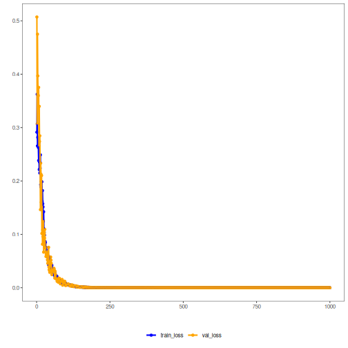

## Autoencoder (Encode) — Visão Geral

Este exemplo demonstra como treinar um autoencoder “vanilla” para aprender uma representação latente (codificação) de uma janela deslizante de uma série temporal. A ideia é reduzir a dimensão de p atributos para k, preservando a informação relevante. Você pode usar os vetores codificados como insumo para outras tarefas (como clustering ou predição).

Pré‑requisitos
- Reticulate configurado e Python com PyTorch instalado
- pacotes R: daltoolbox, tspredit, daltoolboxdp, ggplot2

Passo a passo
1) Preparar o dataset (janelas da série)
2) Normalizar dados (evita escala desbalanceada)
3) Separar treino e teste
4) Treinar o autoencoder (redução de 5 para 3 dimensões)
5) Avaliar perdas e transformar dados em códigos latentes


``` r
# Vanilla autoencoder transformation (encode)

# Considering a dataset with $p$ numerical attributes. 

# The goal of the autoencoder is to reduce the dimension of $p$ to $k$, such that these $k$ attributes are enough to recompose the original $p$ attributes. 

# installing packages

install.packages("tspredit")
install.packages("daltoolboxdp")
```


``` r
# Carregando pacotes necessários
library(daltoolbox)
library(tspredit)
library(daltoolboxdp)
library(ggplot2)
```


``` r
# Dataset de exemplo (série temporal e janelas)

data(tsd)

sw_size <- 5
ts <- ts_data(tsd$y, sw_size)

ts_head(ts)
```

```
##             t4        t3        t2        t1        t0
## [1,] 0.0000000 0.2474040 0.4794255 0.6816388 0.8414710
## [2,] 0.2474040 0.4794255 0.6816388 0.8414710 0.9489846
## [3,] 0.4794255 0.6816388 0.8414710 0.9489846 0.9974950
## [4,] 0.6816388 0.8414710 0.9489846 0.9974950 0.9839859
## [5,] 0.8414710 0.9489846 0.9974950 0.9839859 0.9092974
## [6,] 0.9489846 0.9974950 0.9839859 0.9092974 0.7780732
```


``` r
# Normalização (min-max por grupo) para estabilizar o treino

preproc <- ts_norm_gminmax()
preproc <- fit(preproc, ts)
ts <- transform(preproc, ts)

ts_head(ts)
```

```
##             t4        t3        t2        t1        t0
## [1,] 0.5004502 0.6243512 0.7405486 0.8418178 0.9218625
## [2,] 0.6243512 0.7405486 0.8418178 0.9218625 0.9757058
## [3,] 0.7405486 0.8418178 0.9218625 0.9757058 1.0000000
## [4,] 0.8418178 0.9218625 0.9757058 1.0000000 0.9932346
## [5,] 0.9218625 0.9757058 1.0000000 0.9932346 0.9558303
## [6,] 0.9757058 1.0000000 0.9932346 0.9558303 0.8901126
```


``` r
# Divisão treino / teste

samp <- ts_sample(ts, test_size = 10)
train <- as.data.frame(samp$train)
test <- as.data.frame(samp$test)
```


``` r
# Criando e treinando o autoencoder (reduz de 5 para 3 dimensões)

auto <- autoenc_e(5, 3)

auto <- fit(auto, train)
```


``` r
# Visualizando curvas de perda (treino/validação)
fit_loss <- data.frame(x=1:length(auto$train_loss), train_loss=auto$train_loss,val_loss=auto$val_loss)

grf <- plot_series(fit_loss, colors=c('Blue','Orange'))
plot(grf)
```




``` r
# Testando o autoencoder: codificando exemplos de teste

print(head(test))
```

```
##          t4        t3        t2        t1        t0
## 1 0.7258342 0.8294719 0.9126527 0.9702046 0.9985496
## 2 0.8294719 0.9126527 0.9702046 0.9985496 0.9959251
## 3 0.9126527 0.9702046 0.9985496 0.9959251 0.9624944
## 4 0.9702046 0.9985496 0.9959251 0.9624944 0.9003360
## 5 0.9985496 0.9959251 0.9624944 0.9003360 0.8133146
## 6 0.9959251 0.9624944 0.9003360 0.8133146 0.7068409
```

``` r
result <- transform(auto, test)
print(head(result))
```

```
##           [,1]     [,2]       [,3]
## [1,] -2.133319 1.083079 -0.6535907
## [2,] -2.223497 1.183873 -0.5868651
## [3,] -2.246743 1.240983 -0.5009663
## [4,] -2.201395 1.250513 -0.4013102
## [5,] -2.089066 1.209927 -0.2945161
## [6,] -1.917528 1.123016 -0.1869479
```
