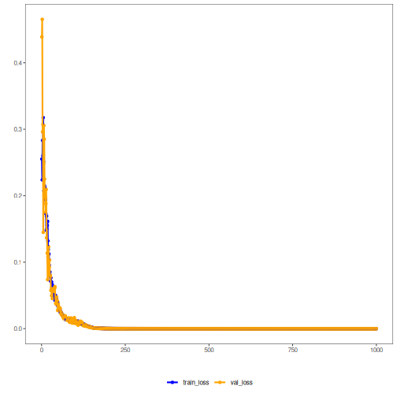

## Autoencoder (Encode-Decode) — Visão Geral

Este exemplo mostra um autoencoder que codifica e reconstrói a entrada. Após treinar a redução de p → k dimensões, o modelo decodifica de volta para p. Quanto melhor o treino, mais próximo o reconstruído fica do original (erro de reconstrução baixo).

Pré‑requisitos
- Reticulate configurado e Python com PyTorch instalado
- pacotes R: daltoolbox, tspredit, daltoolboxdp, ggplot2

Passo a passo
1) Construir janelas da série temporal
2) Normalizar dados
3) Separar treino e teste
4) Treinar o AE (5 → 3) e acompanhar perdas
5) Reconstruir e calcular métricas (R2, MAPE)


``` r
# Vanilla autoencoder transformation (encode-decode)

# Considering a dataset with $p$ numerical attributes.

# The goal of the autoencoder is to reduce the dimension of $p$ to $k$, such that these $k$ attributes are enough to recompose the original $p$ attributes. However from the $k$ dimensionals the data is returned back to $p$ dimensions. The higher the quality of autoencoder the similiar is the output from the input.

# installing packages

install.packages("tspredit")
install.packages("daltoolboxdp")
```


``` r
# Carregando pacotes
library(daltoolbox)
library(tspredit)
library(daltoolboxdp)
library(ggplot2)
```


``` r
# Dataset de exemplo (série → janelas)

data(tsd)

sw_size <- 5
ts <- ts_data(tsd$y, sw_size)

ts_head(ts)
```

```
##             t4        t3        t2        t1        t0
## [1,] 0.0000000 0.2474040 0.4794255 0.6816388 0.8414710
## [2,] 0.2474040 0.4794255 0.6816388 0.8414710 0.9489846
## [3,] 0.4794255 0.6816388 0.8414710 0.9489846 0.9974950
## [4,] 0.6816388 0.8414710 0.9489846 0.9974950 0.9839859
## [5,] 0.8414710 0.9489846 0.9974950 0.9839859 0.9092974
## [6,] 0.9489846 0.9974950 0.9839859 0.9092974 0.7780732
```


``` r
# Normalização (min-max por grupo)

preproc <- ts_norm_gminmax()
preproc <- fit(preproc, ts)
ts <- transform(preproc, ts)

ts_head(ts)
```

```
##             t4        t3        t2        t1        t0
## [1,] 0.5004502 0.6243512 0.7405486 0.8418178 0.9218625
## [2,] 0.6243512 0.7405486 0.8418178 0.9218625 0.9757058
## [3,] 0.7405486 0.8418178 0.9218625 0.9757058 1.0000000
## [4,] 0.8418178 0.9218625 0.9757058 1.0000000 0.9932346
## [5,] 0.9218625 0.9757058 1.0000000 0.9932346 0.9558303
## [6,] 0.9757058 1.0000000 0.9932346 0.9558303 0.8901126
```


``` r
# Divisão treino / teste

samp <- ts_sample(ts, test_size = 10)
train <- as.data.frame(samp$train)
test <- as.data.frame(samp$test)
```


``` r
# Treinando autoencoder (redução 5 → 3)

auto <- autoenc_ed(5, 3)

auto <- fit(auto, train)
```


``` r
# Curvas de perda de treino e validação
fit_loss <- data.frame(x=1:length(auto$train_loss), train_loss=auto$train_loss, val_loss=auto$val_loss)

grf <- plot_series(fit_loss, colors=c('Blue','Orange'))
plot(grf)
```




``` r
# Testando: reconstrução do conjunto de teste

print(head(test))
```

```
##          t4        t3        t2        t1        t0
## 1 0.7258342 0.8294719 0.9126527 0.9702046 0.9985496
## 2 0.8294719 0.9126527 0.9702046 0.9985496 0.9959251
## 3 0.9126527 0.9702046 0.9985496 0.9959251 0.9624944
## 4 0.9702046 0.9985496 0.9959251 0.9624944 0.9003360
## 5 0.9985496 0.9959251 0.9624944 0.9003360 0.8133146
## 6 0.9959251 0.9624944 0.9003360 0.8133146 0.7068409
```

``` r
result <- transform(auto, test)
print(head(result))
```

```
##           [,1]      [,2]      [,3]      [,4]      [,5]
## [1,] 0.7257841 0.8304496 0.9142101 0.9680263 0.9986345
## [2,] 0.8293212 0.9119390 0.9704733 0.9979895 0.9959698
## [3,] 0.9138330 0.9689782 0.9982723 0.9971814 0.9626188
## [4,] 0.9741088 0.9989527 0.9963259 0.9653509 0.9001243
## [5,] 1.0027015 0.9971723 0.9630279 0.9038267 0.8129374
## [6,] 0.9945748 0.9612569 0.8989261 0.8158607 0.7069759
```


``` r
# Avaliando qualidade da reconstrução: R² e MAPE por atributo
result <- as.data.frame(result)
names(result) <- names(test)
r2 <- c()
mape <- c()
for (col in names(test)){
r2_col <- cor(test[col], result[col])^2
r2 <- append(r2, r2_col)
mape_col <- mean((abs((result[col] - test[col]))/test[col])[[col]])
mape <- append(mape, mape_col)
print(paste(col, 'R2 test:', r2_col, 'MAPE:', mape_col))
}
```

```
## [1] "t4 R2 test: 0.999477894224947 MAPE: 0.00186637045768297"
## [1] "t3 R2 test: 0.999831023227896 MAPE: 0.0018737623897964"
## [1] "t2 R2 test: 0.999944909950231 MAPE: 0.00146192645278539"
## [1] "t1 R2 test: 0.999918722856224 MAPE: 0.00371470278147964"
## [1] "t0 R2 test: 0.999991330346745 MAPE: 0.00113579679380565"
```

``` r
print(paste('Means R2 test:', mean(r2), 'MAPE:', mean(mape)))
```

```
## [1] "Means R2 test: 0.999832776121208 MAPE: 0.00201051177511001"
```
