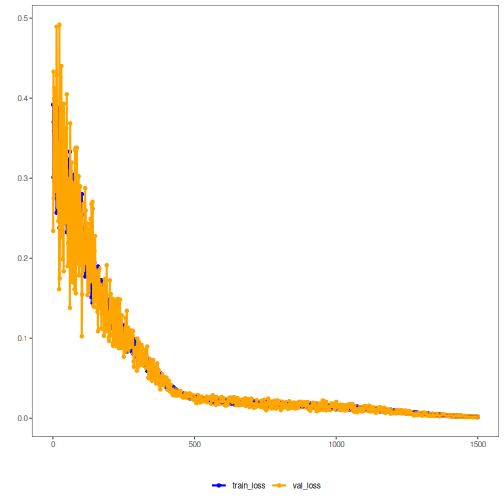

``` r
# LSTM Autoencoder transformation (encode-decode)

# Considering a dataset with $p$ numerical attributes. 
 
# The goal of the autoencoder is to reduce the dimension of $p$ to $k$, such that these $k$ attributes are enough to recompose the original $p$ attributes. However from the $k$ dimensionals the data is returned back to $p$ dimensions. The higher the quality of autoencoder the similiar is the output from the input. 

# installing packages

#install.packages("tspredit")
#install.packages("daltoolboxdp")
```


``` r
# loading DAL
library(daltoolbox)
library(tspredit)
library(daltoolboxdp)
library(ggplot2)
```


``` r
# dataset for example 

data(tsd)

sw_size <- 5
ts <- ts_data(tsd$y, sw_size)

ts_head(ts)
```

```
##             t4        t3        t2        t1        t0
## [1,] 0.0000000 0.2474040 0.4794255 0.6816388 0.8414710
## [2,] 0.2474040 0.4794255 0.6816388 0.8414710 0.9489846
## [3,] 0.4794255 0.6816388 0.8414710 0.9489846 0.9974950
## [4,] 0.6816388 0.8414710 0.9489846 0.9974950 0.9839859
## [5,] 0.8414710 0.9489846 0.9974950 0.9839859 0.9092974
## [6,] 0.9489846 0.9974950 0.9839859 0.9092974 0.7780732
```


``` r
# applying data normalization

preproc <- ts_norm_gminmax()
preproc <- fit(preproc, ts)
ts <- transform(preproc, ts)

ts_head(ts)
```

```
##             t4        t3        t2        t1        t0
## [1,] 0.5004502 0.6243512 0.7405486 0.8418178 0.9218625
## [2,] 0.6243512 0.7405486 0.8418178 0.9218625 0.9757058
## [3,] 0.7405486 0.8418178 0.9218625 0.9757058 1.0000000
## [4,] 0.8418178 0.9218625 0.9757058 1.0000000 0.9932346
## [5,] 0.9218625 0.9757058 1.0000000 0.9932346 0.9558303
## [6,] 0.9757058 1.0000000 0.9932346 0.9558303 0.8901126
```


``` r
# spliting into training and test

samp <- ts_sample(ts, test_size = 10)
train <- as.data.frame(samp$train)
test <- as.data.frame(samp$test)
```


``` r
# creating autoencoder - reduce from 5 to 3 dimensions

auto <- autoenc_lstm_ed(5, 3, num_epochs=1500)

auto <- fit(auto, train)
```


``` r
# learning curves

fit_loss <- data.frame(x=1:length(auto$train_loss), train_loss=auto$train_loss,val_loss=auto$val_loss)

grf <- plot_series(fit_loss, colors=c('Blue','Orange'))
plot(grf)
```




``` r
# testing autoencoder
# presenting the original test set and display encoding

print(head(test))
```

```
##          t4        t3        t2        t1        t0
## 1 0.7258342 0.8294719 0.9126527 0.9702046 0.9985496
## 2 0.8294719 0.9126527 0.9702046 0.9985496 0.9959251
## 3 0.9126527 0.9702046 0.9985496 0.9959251 0.9624944
## 4 0.9702046 0.9985496 0.9959251 0.9624944 0.9003360
## 5 0.9985496 0.9959251 0.9624944 0.9003360 0.8133146
## 6 0.9959251 0.9624944 0.9003360 0.8133146 0.7068409
```

``` r
result <- transform(auto, test)
print(head(result))
```

```
## , , 1
## 
##           [,1]      [,2]      [,3]      [,4]      [,5]
## [1,] 0.8789068 0.8823417 0.8671489 0.8832013 0.8673140
## [2,] 0.9080443 0.9166303 0.8979083 0.9145094 0.8989050
## [3,] 0.9215617 0.9329948 0.9124724 0.9291567 0.9139358
## [4,] 0.9226742 0.9343467 0.9135910 0.9303699 0.9152206
## [5,] 0.9115257 0.9207797 0.9013427 0.9182850 0.9028674
## [6,] 0.8849193 0.8892132 0.8728216 0.8896478 0.8739518
```


``` r
result <- as.data.frame(result)
names(result) <- names(test)
r2 <- c()
mape <- c()
for (col in names(test)){
r2_col <- cor(test[col], result[col])^2
r2 <- append(r2, r2_col)
mape_col <- mean((abs((result[col] - test[col]))/test[col])[[col]])
mape <- append(mape, mape_col)
print(paste(col, 'R2 test:', r2_col, 'MAPE:', mape_col))
}
```

```
## [1] "t4 R2 test: 0.379784272880311 MAPE: 0.143621586793552"
## [1] "t3 R2 test: 0.911645934162342 MAPE: 0.0823427079542245"
## [1] "t2 R2 test: 0.973820808225267 MAPE: 0.0524082358458877"
## [1] "t1 R2 test: 0.900869222204554 MAPE: 0.152302243999315"
## [1] "t0 R2 test: 0.829673970609053 MAPE: 0.352948783604002"
```

``` r
print(paste('Means R2 test:', mean(r2), 'MAPE:', mean(mape)))
```

```
## [1] "Means R2 test: 0.799158841616305 MAPE: 0.156724711639396"
```

