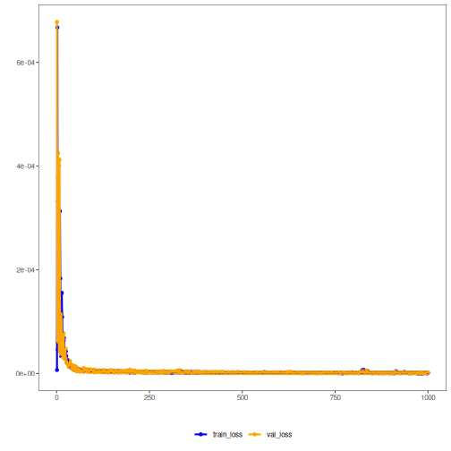

## Autoencoder Empilhado (encode-decode)

Este exemplo demonstra um Autoencoder Empilhado (Stacked) para codificar janelas de série temporal (p -> k) e reconstruí‑las (k -> p), permitindo avaliar a qualidade da reconstrução.

Pré‑requisitos
- Python com PyTorch acessível via reticulate
- Pacotes R: daltoolbox, tspredit, daltoolboxdp, ggplot2


``` r
# Instalando dependências do exemplo (se necessário)
install.packages("tspredit")
install.packages("daltoolboxdp")
```


``` r
# Carregando pacotes necessários
library(daltoolbox)
library(tspredit)
library(daltoolboxdp)
library(ggplot2)
```


``` r
# Conjunto de dados de exemplo (série -> janelas)
data(tsd)

sw_size <- 5                      # tamanho da janela deslizante (p)
ts <- ts_data(tsd$y, sw_size)     # converte série em janelas com p colunas

ts_head(ts)
```

```
##             t4        t3        t2        t1        t0
## [1,] 0.0000000 0.2474040 0.4794255 0.6816388 0.8414710
## [2,] 0.2474040 0.4794255 0.6816388 0.8414710 0.9489846
## [3,] 0.4794255 0.6816388 0.8414710 0.9489846 0.9974950
## [4,] 0.6816388 0.8414710 0.9489846 0.9974950 0.9839859
## [5,] 0.8414710 0.9489846 0.9974950 0.9839859 0.9092974
## [6,] 0.9489846 0.9974950 0.9839859 0.9092974 0.7780732
```


``` r
# Normalização (min-max por grupo)
preproc <- ts_norm_gminmax()
preproc <- fit(preproc, ts)
ts <- transform(preproc, ts)

ts_head(ts)
```

```
##             t4        t3        t2        t1        t0
## [1,] 0.5004502 0.6243512 0.7405486 0.8418178 0.9218625
## [2,] 0.6243512 0.7405486 0.8418178 0.9218625 0.9757058
## [3,] 0.7405486 0.8418178 0.9218625 0.9757058 1.0000000
## [4,] 0.8418178 0.9218625 0.9757058 1.0000000 0.9932346
## [5,] 0.9218625 0.9757058 1.0000000 0.9932346 0.9558303
## [6,] 0.9757058 1.0000000 0.9932346 0.9558303 0.8901126
```


``` r
# Divisão em treino e teste
samp <- ts_sample(ts, test_size = 10)
train <- as.data.frame(samp$train)
test  <- as.data.frame(samp$test)
```


``` r
# Criando o autoencoder empilhado (encode-decode): 5 -> 3 -> 5 dimensões
auto <- autoenc_stacked_ed(5, 3)

# Treinando o modelo
auto <- fit(auto, train)
```


``` r
# Curvas de aprendizado (perda de treino e validação por época)
fit_loss <- data.frame(
  x = 1:length(auto$train_loss),
  train_loss = auto$train_loss,
  val_loss = auto$val_loss
)
grf <- plot_series(fit_loss, colors = c('Blue', 'Orange'))
plot(grf)
```




``` r
# Testando o autoencoder (reconstrução)
# Mostra amostras do conjunto de teste e a reconstrução (p colunas)
print(head(test))
```

```
##          t4        t3        t2        t1        t0
## 1 0.7258342 0.8294719 0.9126527 0.9702046 0.9985496
## 2 0.8294719 0.9126527 0.9702046 0.9985496 0.9959251
## 3 0.9126527 0.9702046 0.9985496 0.9959251 0.9624944
## 4 0.9702046 0.9985496 0.9959251 0.9624944 0.9003360
## 5 0.9985496 0.9959251 0.9624944 0.9003360 0.8133146
## 6 0.9959251 0.9624944 0.9003360 0.8133146 0.7068409
```

``` r
result <- transform(auto, test)
print(head(result))
```

```
##           [,1]      [,2]      [,3]      [,4]      [,5]
## [1,] 0.7266038 0.8304667 0.9121040 0.9696807 0.9988025
## [2,] 0.8276812 0.9122886 0.9685760 0.9978245 0.9947267
## [3,] 0.9114290 0.9718435 0.9982654 0.9974596 0.9597241
## [4,] 0.9697254 1.0016009 0.9968022 0.9656054 0.8966446
## [5,] 0.9970743 0.9948100 0.9613092 0.8992624 0.8117816
## [6,] 0.9966623 0.9610325 0.8993629 0.8107460 0.7062079
```


``` r
# Métricas de reconstrução por coluna: R² e MAPE
result <- as.data.frame(result)
names(result) <- names(test)
r2 <- c()
mape <- c()
for (col in names(test)){
  r2_col <- cor(test[col], result[col])^2
  r2 <- append(r2, r2_col)
  mape_col <- mean((abs((result[col] - test[col]))/test[col])[[col]])
  mape <- append(mape, mape_col)
  print(paste(col, 'R2 teste:', r2_col, 'MAPE:', mape_col))
}
```

```
## [1] "t4 R2 teste: 0.999858419129994 MAPE: 0.00143806596442908"
## [1] "t3 R2 teste: 0.999882271129685 MAPE: 0.00145641875493568"
## [1] "t2 R2 teste: 0.999985089957161 MAPE: 0.00108683576264808"
## [1] "t1 R2 teste: 0.999957431865056 MAPE: 0.00145122837050569"
## [1] "t0 R2 teste: 0.999975096053065 MAPE: 0.00308187516293525"
```

``` r
print(paste('Médias R2 teste:', mean(r2), 'MAPE:', mean(mape)))
```

```
## [1] "Médias R2 teste: 0.999931661626992 MAPE: 0.00170288480309076"
```

