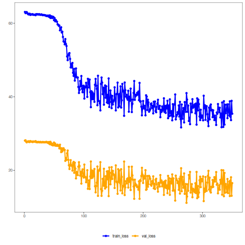

## Variational Autoencoder transformation (encode)

Considering a dataset with $p$ numerical attributes. 

The goal of the autoencoder is to reduce the dimension of $p$ to $k$, such that these $k$ attributes are enough to recompose the original $p$ attributes. 


``` r
# DAL ToolBox
# version 1.1.737


#loading DAL
library(daltoolbox)
library(tspredit)
library(daltoolboxdp)
library(ggplot2)
```

### dataset for example 


``` r
data(sin_data)

sw_size <- 5
ts <- ts_data(sin_data$y, sw_size)

ts_head(ts)
```

```
##             t4        t3        t2        t1        t0
## [1,] 0.0000000 0.2474040 0.4794255 0.6816388 0.8414710
## [2,] 0.2474040 0.4794255 0.6816388 0.8414710 0.9489846
## [3,] 0.4794255 0.6816388 0.8414710 0.9489846 0.9974950
## [4,] 0.6816388 0.8414710 0.9489846 0.9974950 0.9839859
## [5,] 0.8414710 0.9489846 0.9974950 0.9839859 0.9092974
## [6,] 0.9489846 0.9974950 0.9839859 0.9092974 0.7780732
```

### applying data normalization


``` r
preproc <- ts_norm_gminmax()
preproc <- fit(preproc, ts)
ts <- transform(preproc, ts)

ts_head(ts)
```

```
##             t4        t3        t2        t1        t0
## [1,] 0.5004502 0.6243512 0.7405486 0.8418178 0.9218625
## [2,] 0.6243512 0.7405486 0.8418178 0.9218625 0.9757058
## [3,] 0.7405486 0.8418178 0.9218625 0.9757058 1.0000000
## [4,] 0.8418178 0.9218625 0.9757058 1.0000000 0.9932346
## [5,] 0.9218625 0.9757058 1.0000000 0.9932346 0.9558303
## [6,] 0.9757058 1.0000000 0.9932346 0.9558303 0.8901126
```

### spliting into training and test


``` r
samp <- ts_sample(ts, test_size = 10)
train <- as.data.frame(samp$train)
test <- as.data.frame(samp$test)
```

### creating autoencoder
Reduce from 5 to 3 dimensions


``` r
auto <- autoenc_variational_e(5, 3, num_epochs=350)

auto <- fit(auto, train)
```

### learning curves


``` r
fit_loss <- data.frame(x=1:length(auto$train_loss), train_loss=auto$train_loss,val_loss=auto$val_loss)

grf <- plot_series(fit_loss, colors=c('Blue','Orange'))
plot(grf)
```



### testing autoencoder
presenting the original test set and display encoding


``` r
print(head(test))
```

```
##          t4        t3        t2        t1        t0
## 1 0.7258342 0.8294719 0.9126527 0.9702046 0.9985496
## 2 0.8294719 0.9126527 0.9702046 0.9985496 0.9959251
## 3 0.9126527 0.9702046 0.9985496 0.9959251 0.9624944
## 4 0.9702046 0.9985496 0.9959251 0.9624944 0.9003360
## 5 0.9985496 0.9959251 0.9624944 0.9003360 0.8133146
## 6 0.9959251 0.9624944 0.9003360 0.8133146 0.7068409
```

``` r
result <- transform(auto, test)
print(head(result))
```

```
##             [,1]        [,2]       [,3]        [,4]        [,5]          [,6]
## [1,] -0.17791469 -0.07090757 -0.1113895 0.008858420 0.004144171  0.0028574020
## [2,] -0.19733122 -0.02275867 -0.1645847 0.011114791 0.005419845  0.0012668222
## [3,] -0.19334935  0.04474990 -0.2057355 0.011188947 0.007551111 -0.0012141168
## [4,] -0.16705653  0.11185399 -0.2283136 0.010425583 0.008143832 -0.0022858232
## [5,] -0.11898161  0.15362945 -0.2187945 0.009415671 0.005641185  0.0002472252
## [6,] -0.06716703  0.17396526 -0.1881160 0.011199288 0.003386864  0.0001303405
```

