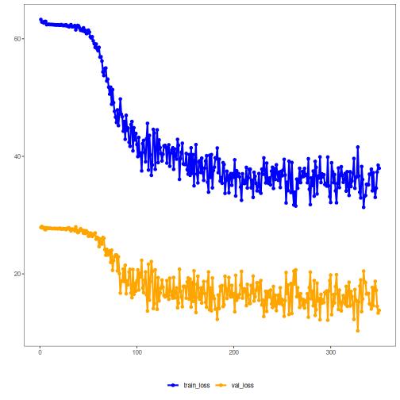

## Autoencoder Variacional (encode)

Este exemplo usa um Autoencoder Variacional (VAE) para aprender representações latentes de janelas de série temporal. O VAE reduz de p para k dimensões e regulariza o espaço latente para aproximar uma distribuição alvo (ex.: normal padrão) via termo KL.

Pré‑requisitos
- Python com PyTorch acessível via reticulate
- Pacotes R: daltoolbox, tspredit, daltoolboxdp, ggplot2

Notas rápidas
- Perda: reconstrutiva + divergência KL entre a distribuição latente e a prior.
- Útil para gerar representações contínuas e bem comportadas no espaço latente.


``` r
# Instalando dependências do exemplo (se necessário)
install.packages("tspredit")
install.packages("daltoolboxdp")
```


``` r
# Carregando pacotes necessários
library(daltoolbox)
library(tspredit)
library(daltoolboxdp)
library(ggplot2)
```


``` r
# Conjunto de dados de exemplo (série -> janelas)
data(tsd)

sw_size <- 5                      # tamanho da janela deslizante (p)
ts <- ts_data(tsd$y, sw_size)     # converte série em janelas com p colunas

ts_head(ts)
```

```
##             t4        t3        t2        t1        t0
## [1,] 0.0000000 0.2474040 0.4794255 0.6816388 0.8414710
## [2,] 0.2474040 0.4794255 0.6816388 0.8414710 0.9489846
## [3,] 0.4794255 0.6816388 0.8414710 0.9489846 0.9974950
## [4,] 0.6816388 0.8414710 0.9489846 0.9974950 0.9839859
## [5,] 0.8414710 0.9489846 0.9974950 0.9839859 0.9092974
## [6,] 0.9489846 0.9974950 0.9839859 0.9092974 0.7780732
```


``` r
# Normalização (min-max por grupo)
preproc <- ts_norm_gminmax()
preproc <- fit(preproc, ts)
ts <- transform(preproc, ts)

ts_head(ts)
```

```
##             t4        t3        t2        t1        t0
## [1,] 0.5004502 0.6243512 0.7405486 0.8418178 0.9218625
## [2,] 0.6243512 0.7405486 0.8418178 0.9218625 0.9757058
## [3,] 0.7405486 0.8418178 0.9218625 0.9757058 1.0000000
## [4,] 0.8418178 0.9218625 0.9757058 1.0000000 0.9932346
## [5,] 0.9218625 0.9757058 1.0000000 0.9932346 0.9558303
## [6,] 0.9757058 1.0000000 0.9932346 0.9558303 0.8901126
```


``` r
# Divisão em treino e teste
samp <- ts_sample(ts, test_size = 10)
train <- as.data.frame(samp$train)
test  <- as.data.frame(samp$test)
```


``` r
# Criando o VAE: reduz de 5 -> 3 dimensões (p -> k)
# - num_epochs: menos épocas podem ser suficientes dado o termo KL adicional
auto <- autoenc_variational_e(5, 3, num_epochs = 350)

# Treinando o modelo
auto <- fit(auto, train)
```


``` r
# Curvas de aprendizado (perda total por época)
fit_loss <- data.frame(
  x = 1:length(auto$train_loss),
  train_loss = auto$train_loss,
  val_loss = auto$val_loss
)
grf <- plot_series(fit_loss, colors = c('Blue', 'Orange'))
plot(grf)
```




``` r
# Testando o VAE (codificação)
# Mostra amostras do conjunto de teste e a codificação (k colunas)
print(head(test))
```

```
##          t4        t3        t2        t1        t0
## 1 0.7258342 0.8294719 0.9126527 0.9702046 0.9985496
## 2 0.8294719 0.9126527 0.9702046 0.9985496 0.9959251
## 3 0.9126527 0.9702046 0.9985496 0.9959251 0.9624944
## 4 0.9702046 0.9985496 0.9959251 0.9624944 0.9003360
## 5 0.9985496 0.9959251 0.9624944 0.9003360 0.8133146
## 6 0.9959251 0.9624944 0.9003360 0.8133146 0.7068409
```

``` r
result <- transform(auto, test)
print(head(result))
```

```
##              [,1]        [,2]       [,3]          [,4]          [,5]         [,6]
## [1,] -0.179695413 -0.01619485 -0.1237035 -0.0054883212 -0.0041387216 -0.001536518
## [2,] -0.178664550  0.04040169 -0.1584055 -0.0035014600 -0.0017229831 -0.002821684
## [3,] -0.154285535  0.11013719 -0.1796886 -0.0021705031  0.0003623795 -0.006522253
## [4,] -0.107917659  0.16292368 -0.1805526 -0.0026185811  0.0005510515 -0.006827340
## [5,] -0.051479183  0.18558842 -0.1566449 -0.0032125860 -0.0040512243 -0.005097672
## [6,] -0.001374023  0.18620345 -0.1135110 -0.0006585643 -0.0081541426 -0.005980015
```

