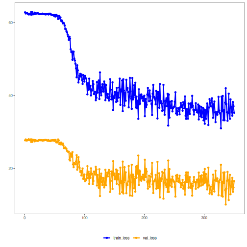

## Variational Autoencoder (encode)

Variational Autoencoders learn a probabilistic encoder that outputs parameters of a latent distribution (e.g., mean and variance) and a decoder that reconstructs from latent samples. The loss combines reconstruction error and a KL divergence that regularizes the latent distribution toward a prior.

This example uses a Variational Autoencoder (VAE) to learn latent representations of time-series windows. The VAE reduces from p to k dimensions and regularizes the latent space to approximate a target distribution (e.g., standard normal) via a KL term.

Prerequisites
- Python with PyTorch accessible via reticulate
- R packages: daltoolbox, tspredit, daltoolboxdp, ggplot2

Quick notes
- Loss: reconstruction + KL divergence between the latent distribution and the prior.
- Useful for generating continuous, well-behaved representations in latent space.


``` r
# Installing example dependencies (if needed)
#install.packages("tspredit")
#install.packages("daltoolboxdp")
```


``` r
# Loading required packages
library(daltoolbox)
library(tspredit)
library(daltoolboxdp)
library(ggplot2)
```


``` r
# Example dataset (series -> windows)
data(tsd)

sw_size <- 5                      # sliding window size (p)
ts <- ts_data(tsd$y, sw_size)     # convert series into windows with p columns

ts_head(ts)
```

```
##             t4        t3        t2        t1        t0
## [1,] 0.0000000 0.2474040 0.4794255 0.6816388 0.8414710
## [2,] 0.2474040 0.4794255 0.6816388 0.8414710 0.9489846
## [3,] 0.4794255 0.6816388 0.8414710 0.9489846 0.9974950
## [4,] 0.6816388 0.8414710 0.9489846 0.9974950 0.9839859
## [5,] 0.8414710 0.9489846 0.9974950 0.9839859 0.9092974
## [6,] 0.9489846 0.9974950 0.9839859 0.9092974 0.7780732
```


``` r
# Normalization (min-max by group)
preproc <- ts_norm_gminmax()
preproc <- fit(preproc, ts)
ts <- transform(preproc, ts)

ts_head(ts)
```

```
##             t4        t3        t2        t1        t0
## [1,] 0.5004502 0.6243512 0.7405486 0.8418178 0.9218625
## [2,] 0.6243512 0.7405486 0.8418178 0.9218625 0.9757058
## [3,] 0.7405486 0.8418178 0.9218625 0.9757058 1.0000000
## [4,] 0.8418178 0.9218625 0.9757058 1.0000000 0.9932346
## [5,] 0.9218625 0.9757058 1.0000000 0.9932346 0.9558303
## [6,] 0.9757058 1.0000000 0.9932346 0.9558303 0.8901126
```


``` r
# Train/test split
samp <- ts_sample(ts, test_size = 10)
train <- as.data.frame(samp$train)
test  <- as.data.frame(samp$test)
```


``` r
# Creating the VAE: reduce from 5 -> 3 dimensions (p -> k)
# - num_epochs: fewer epochs may suffice given the additional KL term
auto <- autoenc_variational_e(5, 3, num_epochs = 350)

# Training the model
auto <- fit(auto, train)
```


``` r
# Learning curves (total loss per epoch)
fit_loss <- data.frame(
  x = 1:length(auto$train_loss),
  train_loss = auto$train_loss,
  val_loss = auto$val_loss
)
grf <- plot_series(fit_loss, colors = c('Blue', 'Orange'))
plot(grf)
```




``` r
# Testing the VAE (encoding)
# Show samples from the test set and the encoding (k columns)
print(head(test))
```

```
##          t4        t3        t2        t1        t0
## 1 0.7258342 0.8294719 0.9126527 0.9702046 0.9985496
## 2 0.8294719 0.9126527 0.9702046 0.9985496 0.9959251
## 3 0.9126527 0.9702046 0.9985496 0.9959251 0.9624944
## 4 0.9702046 0.9985496 0.9959251 0.9624944 0.9003360
## 5 0.9985496 0.9959251 0.9624944 0.9003360 0.8133146
## 6 0.9959251 0.9624944 0.9003360 0.8133146 0.7068409
```

``` r
result <- transform(auto, test)
print(head(result))
```

```
##            [,1]        [,2]        [,3]        [,4]        [,5]        [,6]
## [1,] 0.09563006 -0.08406974 -0.20252025 0.007192686 -0.01273163 0.012905894
## [2,] 0.13504529 -0.03213522 -0.21980235 0.007717811 -0.01337375 0.011788517
## [3,] 0.16515028  0.03197703 -0.21417874 0.006009266 -0.01507257 0.011009218
## [4,] 0.17642504  0.09829776 -0.18024564 0.003366388 -0.01479770 0.009636659
## [5,] 0.16407233  0.14606121 -0.13054705 0.001773089 -0.01295045 0.006309848
## [6,] 0.13657573  0.16959272 -0.07463908 0.001738429 -0.01300437 0.005048607
```

References
- Kingma, D. P., & Welling, M. (2014). Auto-Encoding Variational Bayes. ICLR.
