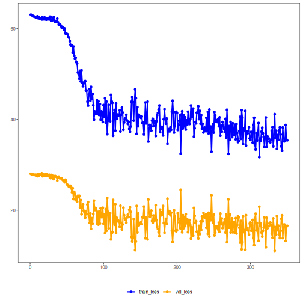

## Autoencoder Variacional (encode-decode)

Este exemplo usa um Autoencoder Variacional (VAE) para codificar janelas de série temporal (p -> k) e reconstruí‑las (k -> p). Avaliamos a qualidade de reconstrução ao final.

Pré‑requisitos
- Python com PyTorch acessível via reticulate
- Pacotes R: daltoolbox, tspredit, daltoolboxdp, ggplot2


``` r
# Instalando dependências do exemplo (se necessário)
install.packages("tspredit")
install.packages("daltoolboxdp")
```


``` r
# Carregando pacotes necessários
library(daltoolbox)
library(tspredit)
library(daltoolboxdp)
library(ggplot2)
```


``` r
# Conjunto de dados de exemplo (série -> janelas)
data(tsd)

sw_size <- 5                      # tamanho da janela deslizante (p)
ts <- ts_data(tsd$y, sw_size)     # converte série em janelas com p colunas

ts_head(ts)
```

```
##             t4        t3        t2        t1        t0
## [1,] 0.0000000 0.2474040 0.4794255 0.6816388 0.8414710
## [2,] 0.2474040 0.4794255 0.6816388 0.8414710 0.9489846
## [3,] 0.4794255 0.6816388 0.8414710 0.9489846 0.9974950
## [4,] 0.6816388 0.8414710 0.9489846 0.9974950 0.9839859
## [5,] 0.8414710 0.9489846 0.9974950 0.9839859 0.9092974
## [6,] 0.9489846 0.9974950 0.9839859 0.9092974 0.7780732
```


``` r
# Normalização (min-max por grupo)
preproc <- ts_norm_gminmax()
preproc <- fit(preproc, ts)
ts <- transform(preproc, ts)

ts_head(ts)
```

```
##             t4        t3        t2        t1        t0
## [1,] 0.5004502 0.6243512 0.7405486 0.8418178 0.9218625
## [2,] 0.6243512 0.7405486 0.8418178 0.9218625 0.9757058
## [3,] 0.7405486 0.8418178 0.9218625 0.9757058 1.0000000
## [4,] 0.8418178 0.9218625 0.9757058 1.0000000 0.9932346
## [5,] 0.9218625 0.9757058 1.0000000 0.9932346 0.9558303
## [6,] 0.9757058 1.0000000 0.9932346 0.9558303 0.8901126
```


``` r
# Divisão em treino e teste
samp <- ts_sample(ts, test_size = 10)
train <- as.data.frame(samp$train)
test  <- as.data.frame(samp$test)
```


``` r
# Criando o VAE (encode-decode): 5 -> 3 -> 5 dimensões
auto <- autoenc_variational_ed(5, 3, num_epochs = 350)

# Treinando o modelo
auto <- fit(auto, train)
```


``` r
# Curvas de aprendizado (perda total por época)
fit_loss <- data.frame(
  x = 1:length(auto$train_loss),
  train_loss = auto$train_loss,
  val_loss = auto$val_loss
)
grf <- plot_series(fit_loss, colors = c('Blue', 'Orange'))
plot(grf)
```




``` r
# Testando o VAE (reconstrução)
# Mostra amostras do conjunto de teste e a reconstrução (p colunas)
print(head(test))
```

```
##          t4        t3        t2        t1        t0
## 1 0.7258342 0.8294719 0.9126527 0.9702046 0.9985496
## 2 0.8294719 0.9126527 0.9702046 0.9985496 0.9959251
## 3 0.9126527 0.9702046 0.9985496 0.9959251 0.9624944
## 4 0.9702046 0.9985496 0.9959251 0.9624944 0.9003360
## 5 0.9985496 0.9959251 0.9624944 0.9003360 0.8133146
## 6 0.9959251 0.9624944 0.9003360 0.8133146 0.7068409
```

``` r
result <- transform(auto, test)
print(head(result))
```

```
##           [,1]      [,2]      [,3]      [,4]      [,5]
## [1,] 0.8658016 0.9143311 0.9332994 0.9248589 0.8885081
## [2,] 0.9182333 0.9558818 0.9686602 0.9629863 0.9362608
## [3,] 0.9173912 0.9552435 0.9681830 0.9624683 0.9354554
## [4,] 0.9112223 0.9507433 0.9645520 0.9584417 0.9299828
## [5,] 0.8886793 0.9333327 0.9499095 0.9425718 0.9095617
## [6,] 0.8478112 0.8984355 0.9188799 0.9098283 0.8713625
```


``` r
# Métricas de reconstrução por coluna: R² e MAPE
result <- as.data.frame(result)
names(result) <- names(test)
r2 <- c()
mape <- c()
for (col in names(test)){
  r2_col <- cor(test[col], result[col])^2
  r2 <- append(r2, r2_col)
  mape_col <- mean((abs((result[col] - test[col]))/test[col])[[col]])
  mape <- append(mape, mape_col)
  print(paste(col, 'R2 teste:', r2_col, 'MAPE:', mape_col))
}
```

```
## [1] "t4 R2 teste: 0.25372679697881 MAPE: 0.179561415728927"
## [1] "t3 R2 teste: 0.856623084935602 MAPE: 0.105108304525086"
## [1] "t2 R2 teste: 0.9881941390026 MAPE: 0.0231449247897302"
## [1] "t1 R2 teste: 0.960674531393627 MAPE: 0.117206708324891"
## [1] "t0 R2 teste: 0.920002718236098 MAPE: 0.301727970903343"
```

``` r
print(paste('Médias R2 teste:', mean(r2), 'MAPE:', mean(mape)))
```

```
## [1] "Médias R2 teste: 0.795844254109347 MAPE: 0.145349864854396"
```

