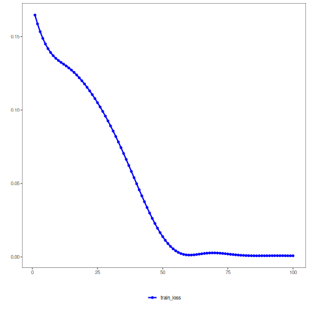

## Stacked Autoencoder (encode)

Stacked autoencoders compose multiple nonlinear layers to gradually compress inputs into a low-dimensional code. Depth allows the model to learn hierarchical features before exposing the compact representation for downstream use.

This example demonstrates a Stacked Autoencoder for encoding time-series windows, reducing from p to k dimensions with successive dense layers.

Prerequisites
- Python with PyTorch accessible via reticulate
- R packages: daltoolbox, tspredit, daltoolboxdp, ggplot2


``` r
source(url("https://raw.githubusercontent.com/cefet-rj-dal/daltoolboxdp/main/examples/seed.R"))
# Installing example dependencies (if needed)
#install.packages("tspredit")
#install.packages("daltoolboxdp")
```


``` r
# Loading required packages
library(daltoolbox)
library(tspredit)
library(daltoolboxdp)
library(ggplot2)
```


``` r
# Example dataset (series -> windows)
data(tsd)

sw_size <- 5                      # sliding window size (p)
ts <- ts_data(tsd$y, sw_size)     # convert series into windows with p columns

ts_head(ts)
```

```
##             t4        t3        t2        t1        t0
## [1,] 0.0000000 0.2474040 0.4794255 0.6816388 0.8414710
## [2,] 0.2474040 0.4794255 0.6816388 0.8414710 0.9489846
## [3,] 0.4794255 0.6816388 0.8414710 0.9489846 0.9974950
## [4,] 0.6816388 0.8414710 0.9489846 0.9974950 0.9839859
## [5,] 0.8414710 0.9489846 0.9974950 0.9839859 0.9092974
## [6,] 0.9489846 0.9974950 0.9839859 0.9092974 0.7780732
```


``` r
# Normalization (min-max by group)
preproc <- ts_norm_gminmax()
set_example_seed()
preproc <- fit(preproc, ts)
ts <- transform(preproc, ts)

ts_head(ts)
```

```
##             t4        t3        t2        t1        t0
## [1,] 0.5004502 0.6243512 0.7405486 0.8418178 0.9218625
## [2,] 0.6243512 0.7405486 0.8418178 0.9218625 0.9757058
## [3,] 0.7405486 0.8418178 0.9218625 0.9757058 1.0000000
## [4,] 0.8418178 0.9218625 0.9757058 1.0000000 0.9932346
## [5,] 0.9218625 0.9757058 1.0000000 0.9932346 0.9558303
## [6,] 0.9757058 1.0000000 0.9932346 0.9558303 0.8901126
```


``` r
# Train/test split
samp <- ts_sample(ts, test_size = 10)
train <- as.data.frame(samp$train)
test  <- as.data.frame(samp$test)
```


``` r
# Creating the stacked autoencoder: reduce from 5 -> 3 dimensions (p -> k)
auto <- autoenc_stacked_e(5, 3)

# Training the model
set_example_seed()
auto <- fit(auto, train)
```

Constructor configuration
- Fixed-epoch baseline: omit `epochs` to use the default value and keep `validation_strategy = "static"` with `stopping_rule = "none"`.
- Static early stopping: keep `validation_strategy = "static"` and choose `stopping_rule = "patience"`, `"sma"`, `"ema"`, or `"h"`.
- Dynamic early stopping: switch `validation_strategy = "dynamic"` and reuse the same stopping rules.
- The loss plot below always shows `train_loss`; it adds `val_loss` when validation is active.

Architecture variations
- `encoding_sizes = c(16L, 8L, 4L)` creates progressively smaller latent stages.
- `encoder_hidden_sizes` can be a single vector shared by all stages or a list with one layout per stage.


``` r
# Learning curves
fit_loss <- data.frame(
  x = seq_along(auto$train_loss),
  train_loss = auto$train_loss
)
if (!is.null(auto$val_loss) && length(auto$val_loss) > 0) {
  fit_loss$val_loss <- auto$val_loss
}
colors <- if ("val_loss" %in% names(fit_loss)) c("Blue", "Orange") else c("Blue")
grf <- plot_series(fit_loss, colors = colors)
plot(grf)
```




``` r
# Testing the autoencoder (encoding)
# Show samples from the test set and the encoding (k columns)
print(head(test))
```

```
##          t4        t3        t2        t1        t0
## 1 0.7258342 0.8294719 0.9126527 0.9702046 0.9985496
## 2 0.8294719 0.9126527 0.9702046 0.9985496 0.9959251
## 3 0.9126527 0.9702046 0.9985496 0.9959251 0.9624944
## 4 0.9702046 0.9985496 0.9959251 0.9624944 0.9003360
## 5 0.9985496 0.9959251 0.9624944 0.9003360 0.8133146
## 6 0.9959251 0.9624944 0.9003360 0.8133146 0.7068409
```

``` r
result <- transform(auto, test)
print(head(result))
```

```
##            [,1]      [,2]      [,3]
## [1,] -0.2930435 0.8482231 0.4212879
## [2,] -0.3307444 0.9131165 0.4447812
## [3,] -0.3476301 0.9421132 0.4557045
## [4,] -0.3471685 0.9412640 0.4554250
## [5,] -0.3303329 0.9124998 0.4447338
## [6,] -0.2912646 0.8457237 0.4214774
```

References
- Bengio, Y., Lamblin, P., Popovici, D., & Larochelle, H. (2007). Greedy layer-wise training of deep networks. NIPS.

