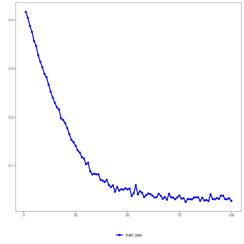

## Denoising Autoencoder (encode-decode)

Inputs are stochastically corrupted during training, and the model learns to reconstruct clean windows. The bottleneck captures noise-invariant structure, and reconstruction metrics quantify how well essential patterns are preserved.

This example demonstrates how to use a denoising autoencoder to encode and reconstruct time-series windows, enabling evaluation of reconstruction quality under noise.

Prerequisites
- Python with PyTorch accessible via reticulate
- R packages: daltoolbox, tspredit, daltoolboxdp, ggplot2

Quick notes
- Noise is applied to the input during training; at inference, the reconstruction tends to be smoother.
- Per-column metrics (R2 and MAPE) help assess robustness per step.


``` r
# Denoising Autoencoder transformation (encode-decode)

# Considering a dataset with $p$ numerical attributes. 

# The goal of the autoencoder is to reduce the dimension of $p$ to $k$, such that these $k$ attributes are enough to recompose the original $p$ attributes. However, from the $k$ dimensions the data is returned back to $p$ dimensions. The higher the autoencoder quality, the more similar the output is to the input. 

# Installing packages
#install.packages("tspredit")
#install.packages("daltoolboxdp")
```


``` r
# Loading packages
library(daltoolbox)
library(tspredit)
library(daltoolboxdp)
library(ggplot2)
```


``` r
# Example dataset (series -> windows) 
data(tsd)

sw_size <- 5
ts <- ts_data(tsd$y, sw_size)

ts_head(ts)
```

```
##             t4        t3        t2        t1        t0
## [1,] 0.0000000 0.2474040 0.4794255 0.6816388 0.8414710
## [2,] 0.2474040 0.4794255 0.6816388 0.8414710 0.9489846
## [3,] 0.4794255 0.6816388 0.8414710 0.9489846 0.9974950
## [4,] 0.6816388 0.8414710 0.9489846 0.9974950 0.9839859
## [5,] 0.8414710 0.9489846 0.9974950 0.9839859 0.9092974
## [6,] 0.9489846 0.9974950 0.9839859 0.9092974 0.7780732
```


``` r
# Normalization (min-max by group)
preproc <- ts_norm_gminmax()
preproc <- fit(preproc, ts)
ts <- transform(preproc, ts)

ts_head(ts)
```

```
##             t4        t3        t2        t1        t0
## [1,] 0.5004502 0.6243512 0.7405486 0.8418178 0.9218625
## [2,] 0.6243512 0.7405486 0.8418178 0.9218625 0.9757058
## [3,] 0.7405486 0.8418178 0.9218625 0.9757058 1.0000000
## [4,] 0.8418178 0.9218625 0.9757058 1.0000000 0.9932346
## [5,] 0.9218625 0.9757058 1.0000000 0.9932346 0.9558303
## [6,] 0.9757058 1.0000000 0.9932346 0.9558303 0.8901126
```


``` r
# Train/test split
samp <- ts_sample(ts, test_size = 10)
train <- as.data.frame(samp$train)
test <- as.data.frame(samp$test)
```


``` r
# Training autoencoder (reduce 5 -> 3)
auto <- autoenc_denoise_ed(5, 3)
auto <- fit(auto, train)
```

Constructor configuration
- Fixed-epoch baseline: omit `epochs` to use the default value and keep `validation_strategy = "static"` with `stopping_rule = "none"`.
- Static early stopping: keep `validation_strategy = "static"` and choose `stopping_rule = "patience"`, `"sma"`, `"ema"`, or `"h"`.
- Dynamic early stopping: switch `validation_strategy = "dynamic"` and reuse the same stopping rules.
- The loss plot below always shows `train_loss`; it adds `val_loss` when validation is active.

Architecture variations
- Use the same dense controls as `autoenc_denoise_e`, plus `output_activation` when reconstruction scale should be constrained.


``` r
fit_loss <- data.frame(x = seq_along(auto$train_loss), train_loss = auto$train_loss)
if (!is.null(auto$val_loss) && length(auto$val_loss) > 0) {
  fit_loss$val_loss <- auto$val_loss
}

colors <- if ("val_loss" %in% names(fit_loss)) c("Blue", "Orange") else c("Blue")
grf <- plot_series(fit_loss, colors = colors)
plot(grf)
```




``` r
# Testing the autoencoder
# Show test samples and display reconstruction
print(head(test))
```

```
##          t4        t3        t2        t1        t0
## 1 0.7258342 0.8294719 0.9126527 0.9702046 0.9985496
## 2 0.8294719 0.9126527 0.9702046 0.9985496 0.9959251
## 3 0.9126527 0.9702046 0.9985496 0.9959251 0.9624944
## 4 0.9702046 0.9985496 0.9959251 0.9624944 0.9003360
## 5 0.9985496 0.9959251 0.9624944 0.9003360 0.8133146
## 6 0.9959251 0.9624944 0.9003360 0.8133146 0.7068409
```

``` r
result <- transform(auto, test)
print(head(result))
```

```
##           [,1]      [,2]      [,3]      [,4]      [,5]
## [1,] 0.7695161 0.8101735 0.8533983 0.8496776 0.8363929
## [2,] 0.8138708 0.8546589 0.9050946 0.8944182 0.8820862
## [3,] 0.8384430 0.8784064 0.9331233 0.9152140 0.9040641
## [4,] 0.8417047 0.8799403 0.9357412 0.9107713 0.9009604
## [5,] 0.8234217 0.8581263 0.9120300 0.8814769 0.8725378
## [6,] 0.7846093 0.8135303 0.8629814 0.8266756 0.8184007
```


``` r
# Reconstruction metrics per column: R2 and MAPE
result <- as.data.frame(result)
names(result) <- names(test)
r2 <- c()
mape <- c()
for (col in names(test)){
  r2_col <- cor(test[col], result[col])^2
  r2 <- append(r2, r2_col)
  mape_col <- mean((abs((result[col] - test[col]))/test[col])[[col]])
  mape <- append(mape, mape_col)
  print(paste(col, 'R2 test:', r2_col, 'MAPE:', mape_col))
}
```

```
## [1] "t4 R2 test: 0.373117489647642 MAPE: 0.185093452655371"
## [1] "t3 R2 test: 0.901409801091287 MAPE: 0.132034283801409"
## [1] "t2 R2 test: 0.997307200698048 MAPE: 0.0408556738452473"
## [1] "t1 R2 test: 0.969394807090173 MAPE: 0.0978274682838399"
## [1] "t0 R2 test: 0.905013555141215 MAPE: 0.262055000131753"
```

``` r
print(paste('Means R2 test:', mean(r2), 'MAPE:', mean(mape)))
```

```
## [1] "Means R2 test: 0.829248570733673 MAPE: 0.143573175743524"
```
 

``` r
# Note: the noise level impacts reconstruction capacity.
```

References
- Vincent, P., Larochelle, H., Bengio, Y., & Manzagol, P. A. (2008). Extracting and composing robust features with denoising autoencoders. ICML.

