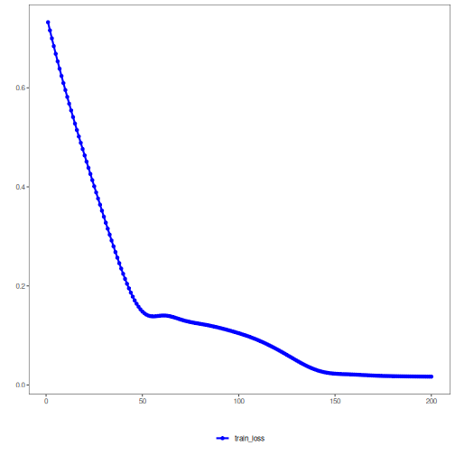

## LSTM Autoencoder (encode-decode)

This example demonstrates the use of an LSTM-based Autoencoder to encode windows of a time series (p -> k) and reconstruct them (k -> p). This allows evaluation of reconstruction quality.

Prerequisites
- Python with PyTorch accessible via reticulate
- R packages: daltoolbox, tspredit, daltoolboxdp, ggplot2


``` r
source(url("https://raw.githubusercontent.com/cefet-rj-dal/daltoolboxdp/main/examples/seed.R"))
# Installing example dependencies (if needed)
#install.packages("tspredit")
#install.packages("daltoolboxdp")
```


``` r
# Loading required packages
library(daltoolbox)
library(tspredit)
library(daltoolboxdp)
library(ggplot2)
```


``` r
# Example dataset (series -> windows)
data(tsd)

sw_size <- 5                      # sliding window size (p)
ts <- ts_data(tsd$y, sw_size)     # convert series into windows with p columns

ts_head(ts)
```

```
##             t4        t3        t2        t1        t0
## [1,] 0.0000000 0.2474040 0.4794255 0.6816388 0.8414710
## [2,] 0.2474040 0.4794255 0.6816388 0.8414710 0.9489846
## [3,] 0.4794255 0.6816388 0.8414710 0.9489846 0.9974950
## [4,] 0.6816388 0.8414710 0.9489846 0.9974950 0.9839859
## [5,] 0.8414710 0.9489846 0.9974950 0.9839859 0.9092974
## [6,] 0.9489846 0.9974950 0.9839859 0.9092974 0.7780732
```


``` r
# Normalization (min-max by group)
preproc <- ts_norm_gminmax()
set_example_seed()
preproc <- fit(preproc, ts)
ts <- transform(preproc, ts)

ts_head(ts)
```

```
##             t4        t3        t2        t1        t0
## [1,] 0.5004502 0.6243512 0.7405486 0.8418178 0.9218625
## [2,] 0.6243512 0.7405486 0.8418178 0.9218625 0.9757058
## [3,] 0.7405486 0.8418178 0.9218625 0.9757058 1.0000000
## [4,] 0.8418178 0.9218625 0.9757058 1.0000000 0.9932346
## [5,] 0.9218625 0.9757058 1.0000000 0.9932346 0.9558303
## [6,] 0.9757058 1.0000000 0.9932346 0.9558303 0.8901126
```


``` r
# Train/test split
samp <- ts_sample(ts, test_size = 10)
train <- as.data.frame(samp$train)
test  <- as.data.frame(samp$test)
```


``` r
# Creating the LSTM autoencoder (encode-decode): 5 -> 3 -> 5 dimensions
# - this example intentionally increases the number of epochs above the library default
auto <- autoenc_lstm_ed(
  5, 3,
  sequence_length = 5L,
  lstm_hidden_size = 16L,
  epochs = 200L
)

# Training the model
set_example_seed()
auto <- fit(auto, train)
```

Constructor configuration
- Fixed-epoch baseline: omit `epochs` to use the default value of `100L` and keep `validation_strategy = "static"` with `stopping_rule = "none"`.
- Static early stopping: keep `validation_strategy = "static"` and choose `stopping_rule = "patience"`, `"sma"`, `"ema"`, or `"h"`.
- Dynamic early stopping: switch `validation_strategy = "dynamic"` and reuse the same stopping rules.
- The loss plot below always shows `train_loss`; it adds `val_loss` when validation is active.

Architecture variations
- The encode-decode LSTM variant uses the same recurrent controls as `autoenc_lstm_e`, but reconstruction quality becomes especially sensitive to `sequence_length`.


``` r
# Learning curves
fit_loss <- data.frame(
  x = seq_along(auto$train_loss),
  train_loss = auto$train_loss
)
if (!is.null(auto$val_loss) && length(auto$val_loss) > 0) {
  fit_loss$val_loss <- auto$val_loss
}
colors <- if ("val_loss" %in% names(fit_loss)) c("Blue", "Orange") else c("Blue")
grf <- plot_series(fit_loss, colors = colors)
plot(grf)
```




``` r
# Testing the autoencoder (reconstruction)
# Show samples from the test set and the reconstruction (p columns)
print(head(test))
```

```
##          t4        t3        t2        t1        t0
## 1 0.7258342 0.8294719 0.9126527 0.9702046 0.9985496
## 2 0.8294719 0.9126527 0.9702046 0.9985496 0.9959251
## 3 0.9126527 0.9702046 0.9985496 0.9959251 0.9624944
## 4 0.9702046 0.9985496 0.9959251 0.9624944 0.9003360
## 5 0.9985496 0.9959251 0.9624944 0.9003360 0.8133146
## 6 0.9959251 0.9624944 0.9003360 0.8133146 0.7068409
```

``` r
result <- transform(auto, test)
print(head(result))
```

```
##           [,1]      [,2]      [,3]      [,4]      [,5]
## [1,] 0.8020369 0.8732355 0.8866003 0.8934108 0.8966115
## [2,] 0.8457412 0.9154114 0.9294263 0.9367943 0.9402944
## [3,] 0.8684114 0.9372982 0.9516782 0.9593308 0.9629780
## [4,] 0.8730984 0.9418222 0.9562809 0.9639927 0.9676696
## [5,] 0.8602504 0.9294081 0.9436603 0.9512156 0.9548118
## [6,] 0.8273532 0.8976525 0.9113972 0.9185417 0.9219207
```


``` r
# Reconstruction metrics per column: R2 and MAPE
result <- as.data.frame(result)
names(result) <- names(test)
r2 <- c()
mape <- c()
for (col in names(test)){
  r2_col <- cor(test[col], result[col])^2
  r2 <- append(r2, r2_col)
  mape_col <- mean((abs((result[col] - test[col]))/test[col])[[col]])
  mape <- append(mape, mape_col)
  print(paste(col, 'R2 test:', r2_col, 'MAPE:', mape_col))
}
```

```
## [1] "t4 R2 test: 0.405757440553139 MAPE: 0.179024423267749"
## [1] "t3 R2 test: 0.930811756892304 MAPE: 0.0718385680693624"
## [1] "t2 R2 test: 0.975238746657783 MAPE: 0.0473822719008916"
## [1] "t1 R2 test: 0.899126731940698 MAPE: 0.174430298840541"
## [1] "t0 R2 test: 0.814744931528733 MAPE: 0.393381932389785"
```

``` r
print(paste('Means R2 test:', mean(r2), 'MAPE:', mean(mape)))
```

```
## [1] "Means R2 test: 0.805135921514531 MAPE: 0.173211498893666"
```

### Method

An LSTM encoder summarizes each window into a compact state that a decoder uses to reconstruct the original sequence. Training minimizes reconstruction loss, encouraging the latent state to retain information about temporal dynamics in the window.

### References
- Hochreiter, S., & Schmidhuber, J. (1997). Long short-term memory. Neural Computation, 9(8), 1735–1780.

