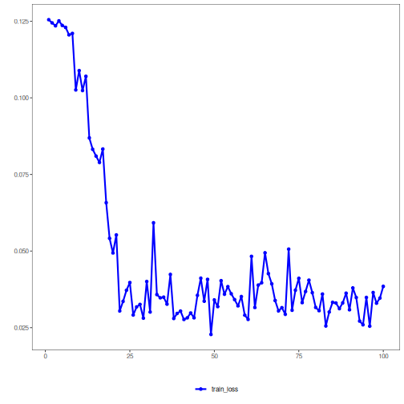

## Adversarial Autoencoder (encode-decode)

An AAE couples reconstruction loss with an adversarial game in latent space. A discriminator distinguishes samples from the encoder vs. the prior, while the encoder seeks to fool it, aligning the aggregate posterior with the chosen prior distribution.

This example shows how to train and use an Adversarial Autoencoder (AAE) in encode-decode mode: the model compresses windows from p to k dimensions and then reconstructs back to p, enabling evaluation of reconstruction error.

Prerequisites
- Python with PyTorch accessible via reticulate
- R packages: daltoolbox, tspredit, daltoolboxdp, ggplot2

Quick notes
- Evaluation: reconstruction quality measured, for example, via R2 and MAPE per window column.
- Hyperparameters: `epochs`, `batch_size` influence convergence and adversarial stability.


``` r
source(url("https://raw.githubusercontent.com/cefet-rj-dal/daltoolboxdp/main/examples/seed.R"))
# Installing example dependencies (if needed)
#install.packages("tspredit")
#install.packages("daltoolboxdp")
```


``` r
# Loading required packages
library(daltoolbox)
library(tspredit)
library(daltoolboxdp)
library(ggplot2)
```


``` r
# Example dataset (series -> windows)
data(tsd)

sw_size <- 5                      # sliding window size (p)
ts <- ts_data(tsd$y, sw_size)     # convert series into windows with p columns

ts_head(ts)
```

```
##             t4        t3        t2        t1        t0
## [1,] 0.0000000 0.2474040 0.4794255 0.6816388 0.8414710
## [2,] 0.2474040 0.4794255 0.6816388 0.8414710 0.9489846
## [3,] 0.4794255 0.6816388 0.8414710 0.9489846 0.9974950
## [4,] 0.6816388 0.8414710 0.9489846 0.9974950 0.9839859
## [5,] 0.8414710 0.9489846 0.9974950 0.9839859 0.9092974
## [6,] 0.9489846 0.9974950 0.9839859 0.9092974 0.7780732
```


``` r
# Normalization (min-max by group)
preproc <- ts_norm_gminmax()
set_example_seed()
preproc <- fit(preproc, ts)
ts <- transform(preproc, ts)

ts_head(ts)
```

```
##             t4        t3        t2        t1        t0
## [1,] 0.5004502 0.6243512 0.7405486 0.8418178 0.9218625
## [2,] 0.6243512 0.7405486 0.8418178 0.9218625 0.9757058
## [3,] 0.7405486 0.8418178 0.9218625 0.9757058 1.0000000
## [4,] 0.8418178 0.9218625 0.9757058 1.0000000 0.9932346
## [5,] 0.9218625 0.9757058 1.0000000 0.9932346 0.9558303
## [6,] 0.9757058 1.0000000 0.9932346 0.9558303 0.8901126
```


``` r
# Train/test split
samp <- ts_sample(ts, test_size = 10)
train <- as.data.frame(samp$train)
test  <- as.data.frame(samp$test)
```


``` r
# Creating the adversarial autoencoder (encode-decode): 5 -> 3 -> 5 dimensions
auto <- autoenc_adv_ed(5, 3, batch_size = 3)

# Training the model
set_example_seed()
auto <- fit(auto, train)
```

Constructor configuration
- Fixed-epoch baseline: omit `epochs` to use the default value and keep `validation_strategy = "static"` with `stopping_rule = "none"`.
- Static early stopping: keep `validation_strategy = "static"` and choose `stopping_rule = "patience"`, `"sma"`, `"ema"`, or `"h"`.
- Dynamic early stopping: switch `validation_strategy = "dynamic"` and reuse the same stopping rules.
- The loss plot below always shows `train_loss`; it adds `val_loss` when validation is active.

Architecture variations
- Reconstruction quality is affected by both decoder width and discriminator strength, so vary them together during tuning.


``` r
# Learning curves
fit_loss <- data.frame(
  x = seq_along(auto$train_loss),
  train_loss = auto$train_loss
)
if (!is.null(auto$val_loss) && length(auto$val_loss) > 0) {
  fit_loss$val_loss <- auto$val_loss
}
colors <- if ("val_loss" %in% names(fit_loss)) c("Blue", "Orange") else c("Blue")
grf <- plot_series(fit_loss, colors = colors)
plot(grf)
```




``` r
# Testing the autoencoder (reconstruction)
# Show samples from the test set and the generated reconstruction (p columns)
print(head(test))
```

```
##          t4        t3        t2        t1        t0
## 1 0.7258342 0.8294719 0.9126527 0.9702046 0.9985496
## 2 0.8294719 0.9126527 0.9702046 0.9985496 0.9959251
## 3 0.9126527 0.9702046 0.9985496 0.9959251 0.9624944
## 4 0.9702046 0.9985496 0.9959251 0.9624944 0.9003360
## 5 0.9985496 0.9959251 0.9624944 0.9003360 0.8133146
## 6 0.9959251 0.9624944 0.9003360 0.8133146 0.7068409
```

``` r
result <- transform(auto, test)
print(head(result))
```

```
##           [,1]      [,2]      [,3]      [,4]      [,5]
## [1,] 0.8562023 0.8797798 0.8969775 0.9046128 0.8631716
## [2,] 0.8777942 0.9007906 0.9167032 0.9225532 0.8863820
## [3,] 0.8879850 0.9102891 0.9256060 0.9307374 0.8970959
## [4,] 0.8875417 0.9098719 0.9251912 0.9303111 0.8965375
## [5,] 0.8763182 0.8993945 0.9152974 0.9211066 0.8845124
## [6,] 0.8541295 0.8773417 0.8946657 0.9023692 0.8601568
```


``` r
# Reconstruction metrics per column: R2 and MAPE
# Note: MAPE can be sensitive to values close to zero.
result <- as.data.frame(result)
names(result) <- names(test)
r2 <- c()
mape <- c()
for (col in names(test)){
  r2_col <- cor(test[col], result[col])^2
  r2 <- append(r2, r2_col)
  mape_col <- mean((abs((result[col] - test[col]))/test[col])[[col]])
  mape <- append(mape, mape_col)
  print(paste(col, 'R2 test:', r2_col, 'MAPE:', mape_col))
}
```

```
## [1] "t4 R2 test: 0.375911528881646 MAPE: 0.129504914212416"
## [1] "t3 R2 test: 0.888947315745117 MAPE: 0.0751364344142231"
## [1] "t2 R2 test: 0.923756874271274 MAPE: 0.0859862979626249"
## [1] "t1 R2 test: 0.819433837539229 MAPE: 0.208802527212727"
## [1] "t0 R2 test: 0.799873512433951 MAPE: 0.377494765388803"
```

``` r
print(paste('Means R2 test:', mean(r2), 'MAPE:', mean(mape)))
```

```
## [1] "Means R2 test: 0.761584613774243 MAPE: 0.175384987838159"
```

References
- Makhzani, A., Shlens, J., Jaitly, N., Goodfellow, I., & Frey, B. (2015). Adversarial Autoencoders. arXiv:1511.05644.

