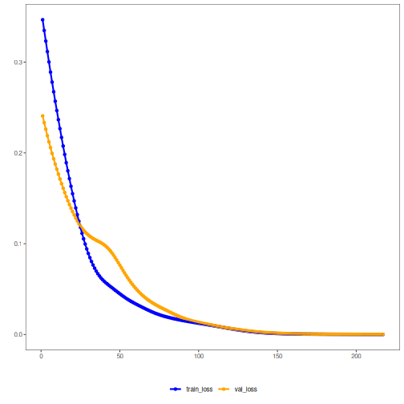

## 21. Autoencoder (Encode-Decode) with Static Validation and Patience

This example keeps the simple dense autoencoder architecture, but changes the training regime to use a fixed validation split and patience-based early stopping. It is useful when reconstruction quality matters and you want a stable reference validation subset across epochs.

Prerequisites
- Reticulate configured and Python with PyTorch installed
- R packages: daltoolbox, tspredit, daltoolboxdp, ggplot2


``` r
source(url("https://raw.githubusercontent.com/cefet-rj-dal/daltoolboxdp/main/examples/seed.R"))
# Installing packages
#install.packages("tspredit")
#install.packages("daltoolboxdp")
```


``` r
# Loading packages
library(daltoolbox)
library(tspredit)
library(daltoolboxdp)
library(ggplot2)
```


``` r
# Example dataset (series -> windows)
data(tsd)

sw_size <- 5
ts <- ts_data(tsd$y, sw_size)

preproc <- ts_norm_gminmax()
set_example_seed()
preproc <- fit(preproc, ts)
ts <- transform(preproc, ts)

samp <- ts_sample(ts, test_size = 10)
train <- as.data.frame(samp$train)
test <- as.data.frame(samp$test)
```


``` r
# Static validation with patience-based early stopping
auto <- autoenc_ed(
  5, 3,
  epochs = 300L,
  validation_strategy = "static",
  stopping_rule = "patience",
  patience = 20L,
  val_ratio = 0.2
)
set_example_seed()
auto <- fit(auto, train)
```

Training configuration
- `validation_strategy = "static"` keeps the same validation partition during the whole training run.
- `stopping_rule = "patience"` stops training when validation loss does not improve for a chosen number of epochs.
- `epochs = 300L` is only an upper bound; the effective number of epochs is determined by early stopping.


``` r
# Effective training duration
print(length(auto$train_loss))
```

```
## [1] 217
```


``` r
# Training and validation curves
fit_loss <- data.frame(x = seq_along(auto$train_loss), train_loss = auto$train_loss)
if (!is.null(auto$val_loss) && length(auto$val_loss) > 0) {
  fit_loss$val_loss <- auto$val_loss
}

colors <- if ("val_loss" %in% names(fit_loss)) c("Blue", "Orange") else c("Blue")
grf <- plot_series(fit_loss, colors = colors)
plot(grf)
```




``` r
# Testing: reconstruction of the test set
print(head(test))
```

```
##          t4        t3        t2        t1        t0
## 1 0.7258342 0.8294719 0.9126527 0.9702046 0.9985496
## 2 0.8294719 0.9126527 0.9702046 0.9985496 0.9959251
## 3 0.9126527 0.9702046 0.9985496 0.9959251 0.9624944
## 4 0.9702046 0.9985496 0.9959251 0.9624944 0.9003360
## 5 0.9985496 0.9959251 0.9624944 0.9003360 0.8133146
## 6 0.9959251 0.9624944 0.9003360 0.8133146 0.7068409
```

``` r
result <- transform(auto, test)
result <- as.data.frame(result)
names(result) <- names(test)
print(head(result))
```

```
##          t4        t3        t2        t1        t0
## 1 0.7287149 0.8282377 0.9163946 0.9744955 0.9900426
## 2 0.8314253 0.9107530 0.9836144 0.9987241 0.9901440
## 3 0.9129117 0.9721819 1.0217745 0.9915266 0.9624805
## 4 0.9663128 1.0024289 1.0209402 0.9509249 0.9025562
## 5 0.9954127 0.9985185 0.9808464 0.8880733 0.8161761
## 6 0.9955173 0.9674534 0.9104724 0.8019085 0.7105464
```


``` r
# Evaluating reconstruction quality: R2 and MAPE per attribute
r2 <- c()
mape <- c()
for (col in names(test)){
  r2_col <- cor(test[col], result[col])^2
  r2 <- append(r2, r2_col)
  mape_col <- mean((abs((result[col] - test[col]))/test[col])[[col]])
  mape <- append(mape, mape_col)
  print(paste(col, 'R2 test:', r2_col, 'MAPE:', mape_col))
}
```

```
## [1] "t4 R2 test: 0.99703328160203 MAPE: 0.00528832535814331"
## [1] "t3 R2 test: 0.996675145441618 MAPE: 0.00885696851470828"
## [1] "t2 R2 test: 0.999654460438017 MAPE: 0.0250995825305561"
## [1] "t1 R2 test: 0.999452449268473 MAPE: 0.009416205821887"
## [1] "t0 R2 test: 0.999256541427767 MAPE: 0.0166771916225412"
```

``` r
print(paste('Means R2 test:', mean(r2), 'MAPE:', mean(mape)))
```

```
## [1] "Means R2 test: 0.998414375635581 MAPE: 0.0130676547695672"
```

Notes
- This setup is easier to interpret because all epochs are judged against the same validation subset.
- To compare with redrawn validation splits, see `22_autoenc_ed_dynamic_patience`.

References
- Goodfellow, I., Bengio, Y., & Courville, A. (2016). Deep Learning. MIT Press. (Chapter on Autoencoders)
