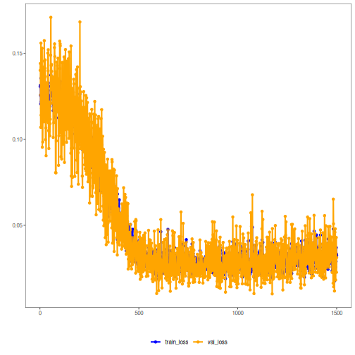

## Adversarial Autoencoder (encode)

This example shows how to train and use an Adversarial Autoencoder (AAE) to encode windows of a time series, reducing from p to k dimensions while imposing a desired distribution in the latent space via an adversarial discriminator.

Prerequisites
- Python with PyTorch accessible via reticulate
- R packages: daltoolbox, tspredit, daltoolboxdp, ggplot2

Quick notes
- Architecture: encoder + decoder, with a discriminator in the latent space for adversarial regularization.
- Goal: learn compact representations (k) that preserve information from the original windows (p).
- Important hyperparameters: `num_epochs`, `batch_size`, learning rate defined internally.


``` r
# Installing example dependencies (if needed)
#install.packages("tspredit")
#install.packages("daltoolboxdp")
```


``` r
# Loading required packages
library(daltoolbox)
library(tspredit)
library(daltoolboxdp)
library(ggplot2)
```


``` r
# Example dataset (series -> windows)
data(tsd)

sw_size <- 5                      # sliding window size (p)
ts <- ts_data(tsd$y, sw_size)     # convert series into windows with p columns

ts_head(ts)                       # preview first rows
```

```
##             t4        t3        t2        t1        t0
## [1,] 0.0000000 0.2474040 0.4794255 0.6816388 0.8414710
## [2,] 0.2474040 0.4794255 0.6816388 0.8414710 0.9489846
## [3,] 0.4794255 0.6816388 0.8414710 0.9489846 0.9974950
## [4,] 0.6816388 0.8414710 0.9489846 0.9974950 0.9839859
## [5,] 0.8414710 0.9489846 0.9974950 0.9839859 0.9092974
## [6,] 0.9489846 0.9974950 0.9839859 0.9092974 0.7780732
```


``` r
# Normalization (min-max by group)
# Keeps each column (window step) on the same [0,1] scale
preproc <- ts_norm_gminmax()
preproc <- fit(preproc, ts)
ts <- transform(preproc, ts)

ts_head(ts)
```

```
##             t4        t3        t2        t1        t0
## [1,] 0.5004502 0.6243512 0.7405486 0.8418178 0.9218625
## [2,] 0.6243512 0.7405486 0.8418178 0.9218625 0.9757058
## [3,] 0.7405486 0.8418178 0.9218625 0.9757058 1.0000000
## [4,] 0.8418178 0.9218625 0.9757058 1.0000000 0.9932346
## [5,] 0.9218625 0.9757058 1.0000000 0.9932346 0.9558303
## [6,] 0.9757058 1.0000000 0.9932346 0.9558303 0.8901126
```


``` r
# Train/test split
samp <- ts_sample(ts, test_size = 10)
train <- as.data.frame(samp$train)
test  <- as.data.frame(samp$test)
```


``` r
# Creating the adversarial autoencoder: reduce from 5 -> 3 dimensions (p -> k)
# - batch_size: training batch size per step
# - num_epochs: number of training epochs
auto <- autoenc_adv_e(5, 3, batch_size = 3, num_epochs = 1500)

# Training the model on the train set
auto <- fit(auto, train)
```


``` r
# Learning curves (train and validation loss per epoch)
fit_loss <- data.frame(
  x = 1:length(auto$train_loss),
  train_loss = auto$train_loss,
  val_loss = auto$val_loss
)
grf <- plot_series(fit_loss, colors = c('Blue', 'Orange'))
plot(grf)
```




``` r
# Testing the autoencoder (encoding only)
# Show samples from the test set and the resulting encoding (k columns)
print(head(test))
```

```
##          t4        t3        t2        t1        t0
## 1 0.7258342 0.8294719 0.9126527 0.9702046 0.9985496
## 2 0.8294719 0.9126527 0.9702046 0.9985496 0.9959251
## 3 0.9126527 0.9702046 0.9985496 0.9959251 0.9624944
## 4 0.9702046 0.9985496 0.9959251 0.9624944 0.9003360
## 5 0.9985496 0.9959251 0.9624944 0.9003360 0.8133146
## 6 0.9959251 0.9624944 0.9003360 0.8133146 0.7068409
```

``` r
result <- transform(auto, test)
print(head(result))
```

```
##          [,1]      [,2]       [,3]
## [1,] 3.443070 -3.223510 -0.1417844
## [2,] 2.728544 -2.269895 -1.0196624
## [3,] 5.161405 -5.343653  1.0087751
## [4,] 3.269723 -3.891940  0.3520791
## [5,] 2.840159 -3.249566  0.7028705
## [6,] 2.088416 -1.153962 -1.0455382
```

