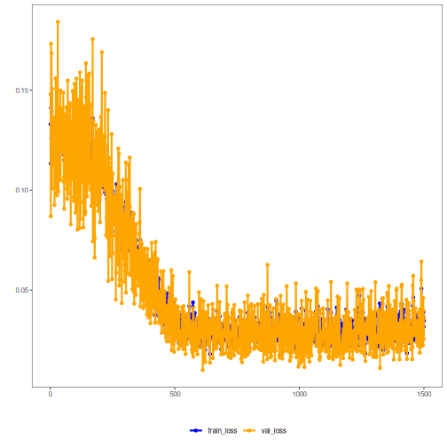

## Adversarial Autoencoder (encode-decode)

This example shows how to train and use an Adversarial Autoencoder (AAE) in encode-decode mode: the model compresses windows from p to k dimensions and then reconstructs back to p, enabling evaluation of reconstruction error.

Prerequisites
- Python with PyTorch accessible via reticulate
- R packages: daltoolbox, tspredit, daltoolboxdp, ggplot2

Quick notes
- Evaluation: reconstruction quality measured, for example, via R2 and MAPE per window column.
- Hyperparameters: `num_epochs`, `batch_size` influence convergence and adversarial stability.


``` r
# Installing example dependencies (if needed)
#install.packages("tspredit")
#install.packages("daltoolboxdp")
```


``` r
# Loading required packages
library(daltoolbox)
library(tspredit)
library(daltoolboxdp)
library(ggplot2)
```


``` r
# Example dataset (series -> windows)
data(tsd)

sw_size <- 5                      # sliding window size (p)
ts <- ts_data(tsd$y, sw_size)     # convert series into windows with p columns

ts_head(ts)
```

```
##             t4        t3        t2        t1        t0
## [1,] 0.0000000 0.2474040 0.4794255 0.6816388 0.8414710
## [2,] 0.2474040 0.4794255 0.6816388 0.8414710 0.9489846
## [3,] 0.4794255 0.6816388 0.8414710 0.9489846 0.9974950
## [4,] 0.6816388 0.8414710 0.9489846 0.9974950 0.9839859
## [5,] 0.8414710 0.9489846 0.9974950 0.9839859 0.9092974
## [6,] 0.9489846 0.9974950 0.9839859 0.9092974 0.7780732
```


``` r
# Normalization (min-max by group)
preproc <- ts_norm_gminmax()
preproc <- fit(preproc, ts)
ts <- transform(preproc, ts)

ts_head(ts)
```

```
##             t4        t3        t2        t1        t0
## [1,] 0.5004502 0.6243512 0.7405486 0.8418178 0.9218625
## [2,] 0.6243512 0.7405486 0.8418178 0.9218625 0.9757058
## [3,] 0.7405486 0.8418178 0.9218625 0.9757058 1.0000000
## [4,] 0.8418178 0.9218625 0.9757058 1.0000000 0.9932346
## [5,] 0.9218625 0.9757058 1.0000000 0.9932346 0.9558303
## [6,] 0.9757058 1.0000000 0.9932346 0.9558303 0.8901126
```


``` r
# Train/test split
samp <- ts_sample(ts, test_size = 10)
train <- as.data.frame(samp$train)
test  <- as.data.frame(samp$test)
```


``` r
# Creating the adversarial autoencoder (encode-decode): 5 -> 3 -> 5 dimensions
auto <- autoenc_adv_ed(5, 3, batch_size = 3, num_epochs = 1500)

# Training the model
auto <- fit(auto, train)
```


``` r
# Learning curves (train and validation loss per epoch)
fit_loss <- data.frame(
  x = 1:length(auto$train_loss),
  train_loss = auto$train_loss,
  val_loss = auto$val_loss
)
grf <- plot_series(fit_loss, colors = c('Blue', 'Orange'))
plot(grf)
```




``` r
# Testing the autoencoder (reconstruction)
# Show samples from the test set and the generated reconstruction (p columns)
print(head(test))
```

```
##          t4        t3        t2        t1        t0
## 1 0.7258342 0.8294719 0.9126527 0.9702046 0.9985496
## 2 0.8294719 0.9126527 0.9702046 0.9985496 0.9959251
## 3 0.9126527 0.9702046 0.9985496 0.9959251 0.9624944
## 4 0.9702046 0.9985496 0.9959251 0.9624944 0.9003360
## 5 0.9985496 0.9959251 0.9624944 0.9003360 0.8133146
## 6 0.9959251 0.9624944 0.9003360 0.8133146 0.7068409
```

``` r
result <- transform(auto, test)
print(head(result))
```

```
##           [,1]      [,2]      [,3]      [,4]      [,5]
## [1,] 0.8574938 0.9097413 0.9355534 0.9376464 0.8932450
## [2,] 0.8843769 0.9324329 0.9543950 0.9567116 0.9172468
## [3,] 0.8956631 0.9413828 0.9614758 0.9638525 0.9270380
## [4,] 0.8934240 0.9396408 0.9600500 0.9624438 0.9250727
## [5,] 0.8773618 0.9267331 0.9496683 0.9519014 0.9110340
## [6,] 0.8448245 0.8981494 0.9253392 0.9271518 0.8810369
```


``` r
# Reconstruction metrics per column: R2 and MAPE
# Note: MAPE can be sensitive to values close to zero.
result <- as.data.frame(result)
names(result) <- names(test)
r2 <- c()
mape <- c()
for (col in names(test)){
  r2_col <- cor(test[col], result[col])^2
  r2 <- append(r2, r2_col)
  mape_col <- mean((abs((result[col] - test[col]))/test[col])[[col]])
  mape <- append(mape, mape_col)
  print(paste(col, 'R2 test:', r2_col, 'MAPE:', mape_col))
}
```

```
## [1] "t4 R2 test: 0.330412449831855 MAPE: 0.164541736478543"
## [1] "t3 R2 test: 0.888291878904282 MAPE: 0.088569206430928"
## [1] "t2 R2 test: 0.954490884385285 MAPE: 0.0459521497194143"
## [1] "t1 R2 test: 0.89884936582842 MAPE: 0.141929190231187"
## [1] "t0 R2 test: 0.845949690822771 MAPE: 0.323693607093233"
```

``` r
print(paste('Means R2 test:', mean(r2), 'MAPE:', mean(mape)))
```

```
## [1] "Means R2 test: 0.783598853954522 MAPE: 0.152937177990661"
```

