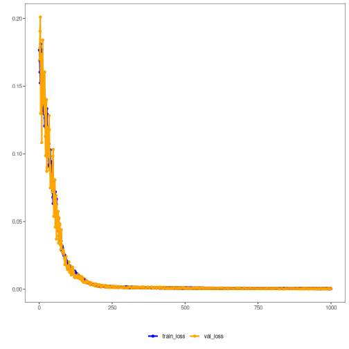

## Convolutional Autoencoder (encode)

Convolutional autoencoders apply 1D convolutions to capture local patterns within windows. The encoder compresses the input via learned filters and pooling (if used), while the decoder reconstructs from the compact code. This inductive bias suits structured temporal neighborhoods.

This example demonstrates how to use a 1D convolutional autoencoder to encode windows from a time series, reducing from p to k dimensions while preserving relevant information.

Prerequisites
- Python with PyTorch accessible via reticulate
- R packages: daltoolbox, tspredit, daltoolboxdp, ggplot2

Quick notes
- Architecture: Conv1D layers in encoder/decoder to capture local patterns in each window.
- Useful when there are local structures (short trends, repeating patterns) within the window.


``` r
# Convolutional Autoencoder transformation (encode)

# Considering a dataset with $p$ numerical attributes. 

# The goal of the autoencoder is to reduce the dimension of $p$ to $k$, such that these $k$ attributes are enough to recompose the original $p$ attributes. 

# Installing packages
#install.packages("tspredit")
#install.packages("daltoolboxdp")
```


``` r
# Loading packages
library(daltoolbox)
library(tspredit)
library(daltoolboxdp)
library(ggplot2)
```


``` r
# Example dataset (series -> windows) 
data(tsd)

sw_size <- 5
ts <- ts_data(tsd$y, sw_size)

ts_head(ts)
```

```
##             t4        t3        t2        t1        t0
## [1,] 0.0000000 0.2474040 0.4794255 0.6816388 0.8414710
## [2,] 0.2474040 0.4794255 0.6816388 0.8414710 0.9489846
## [3,] 0.4794255 0.6816388 0.8414710 0.9489846 0.9974950
## [4,] 0.6816388 0.8414710 0.9489846 0.9974950 0.9839859
## [5,] 0.8414710 0.9489846 0.9974950 0.9839859 0.9092974
## [6,] 0.9489846 0.9974950 0.9839859 0.9092974 0.7780732
```


``` r
# Normalization (min-max by group)
preproc <- ts_norm_gminmax()
preproc <- fit(preproc, ts)
ts <- transform(preproc, ts)

ts_head(ts)
```

```
##             t4        t3        t2        t1        t0
## [1,] 0.5004502 0.6243512 0.7405486 0.8418178 0.9218625
## [2,] 0.6243512 0.7405486 0.8418178 0.9218625 0.9757058
## [3,] 0.7405486 0.8418178 0.9218625 0.9757058 1.0000000
## [4,] 0.8418178 0.9218625 0.9757058 1.0000000 0.9932346
## [5,] 0.9218625 0.9757058 1.0000000 0.9932346 0.9558303
## [6,] 0.9757058 1.0000000 0.9932346 0.9558303 0.8901126
```


``` r
# Train/test split
samp <- ts_sample(ts, test_size = 10)
train <- as.data.frame(samp$train)
test <- as.data.frame(samp$test)
```


``` r
# Training autoencoder (reduce 5 -> 3)
auto <- autoenc_conv_e(5, 3)
auto <- fit(auto, train)
```


``` r
fit_loss <- data.frame(x=1:length(auto$train_loss), train_loss=auto$train_loss,val_loss=auto$val_loss)

grf <- plot_series(fit_loss, colors=c('Blue','Orange'))
plot(grf)
```


 

``` r
# The curves show the loss evolution; stable decreases indicate good learning
```


``` r
# Testing the autoencoder
# Show test samples and display encoding
print(head(test))
```

```
##          t4        t3        t2        t1        t0
## 1 0.7258342 0.8294719 0.9126527 0.9702046 0.9985496
## 2 0.8294719 0.9126527 0.9702046 0.9985496 0.9959251
## 3 0.9126527 0.9702046 0.9985496 0.9959251 0.9624944
## 4 0.9702046 0.9985496 0.9959251 0.9624944 0.9003360
## 5 0.9985496 0.9959251 0.9624944 0.9003360 0.8133146
## 6 0.9959251 0.9624944 0.9003360 0.8133146 0.7068409
```

``` r
result <- transform(auto, test)
print(head(result))
```

```
##             [,1]      [,2]     [,3]
## [1,] -1.21167040 -1.010555 1.202970
## [2,] -1.00877082 -1.172593 1.362596
## [3,] -0.79462379 -1.281883 1.452864
## [4,] -0.53595477 -1.324760 1.406055
## [5,] -0.28305960 -1.301469 1.268140
## [6,] -0.06857897 -1.194953 1.033024
```

References
- Masci, J., Meier, U., Ciresan, D., & Schmidhuber, J. (2011). Stacked Convolutional Auto-Encoders for Hierarchical Feature Extraction. ICANN.
