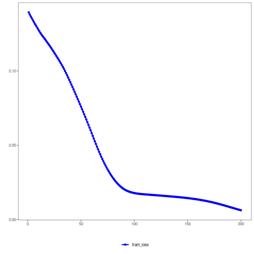

## Convolutional Autoencoder (encode-decode)

1D convolutional layers learn filters that respond to short-term structures in the window, yielding a compressed representation that the decoder expands back to the original dimensionality. Reconstruction error evaluates how well local patterns are preserved.

This example demonstrates how to use a 1D convolutional autoencoder to encode and reconstruct windows from a time series. After reducing from p to k dimensions, the model reconstructs back to p, enabling evaluation of reconstruction error.

Prerequisites
- Python with PyTorch accessible via reticulate
- R packages: daltoolbox, tspredit, daltoolboxdp, ggplot2

Quick notes
- Reconstruction: compare input and output to verify local patterns are preserved.
- Metrics: R2 and MAPE per column help measure quality across window steps.


``` r
# Convolutional Autoencoder transformation (encode-decode)

# Considering a dataset with $p$ numerical attributes. 

# The goal of the autoencoder is to reduce the dimension of $p$ to $k$, such that these $k$ attributes are enough to recompose the original $p$ attributes. However, from the $k$ dimensions the data is returned back to $p$ dimensions. The higher the autoencoder quality, the more similar the output is to the input. 

# Installing packages
#install.packages("tspredit")
#install.packages("daltoolboxdp")
```


``` r
# Loading packages
library(daltoolbox)
library(tspredit)
library(daltoolboxdp)
library(ggplot2)
```


``` r
# Example dataset (series -> windows) 
data(tsd)

sw_size <- 5
ts <- ts_data(tsd$y, sw_size)

ts_head(ts)
```

```
##             t4        t3        t2        t1        t0
## [1,] 0.0000000 0.2474040 0.4794255 0.6816388 0.8414710
## [2,] 0.2474040 0.4794255 0.6816388 0.8414710 0.9489846
## [3,] 0.4794255 0.6816388 0.8414710 0.9489846 0.9974950
## [4,] 0.6816388 0.8414710 0.9489846 0.9974950 0.9839859
## [5,] 0.8414710 0.9489846 0.9974950 0.9839859 0.9092974
## [6,] 0.9489846 0.9974950 0.9839859 0.9092974 0.7780732
```


``` r
# Normalization (min-max by group)
preproc <- ts_norm_gminmax()
preproc <- fit(preproc, ts)
ts <- transform(preproc, ts)

ts_head(ts)
```

```
##             t4        t3        t2        t1        t0
## [1,] 0.5004502 0.6243512 0.7405486 0.8418178 0.9218625
## [2,] 0.6243512 0.7405486 0.8418178 0.9218625 0.9757058
## [3,] 0.7405486 0.8418178 0.9218625 0.9757058 1.0000000
## [4,] 0.8418178 0.9218625 0.9757058 1.0000000 0.9932346
## [5,] 0.9218625 0.9757058 1.0000000 0.9932346 0.9558303
## [6,] 0.9757058 1.0000000 0.9932346 0.9558303 0.8901126
```


``` r
# Train/test split
samp <- ts_sample(ts, test_size = 10)
train <- as.data.frame(samp$train)
test <- as.data.frame(samp$test)
```


``` r
# Training autoencoder (reduce 5 -> 3)
auto <- autoenc_conv_ed(5, 3, epochs = 200L)
auto <- fit(auto, train)
```

Constructor configuration
- Fixed-epoch baseline: omit `epochs` to use the default value of `100L` and keep `validation_strategy = "static"` with `stopping_rule = "none"`.
- Static early stopping: keep `validation_strategy = "static"` and choose `stopping_rule = "patience"`, `"sma"`, `"ema"`, or `"h"`.
- Dynamic early stopping: switch `validation_strategy = "dynamic"` and reuse the same stopping rules.
- The loss plot below always shows `train_loss`; it adds `val_loss` when validation is active.
- This example intentionally raises `epochs` to `200L`, because the convolutional autoencoder was still improving noticeably at the 100-epoch default.


``` r
fit_loss <- data.frame(x = seq_along(auto$train_loss), train_loss = auto$train_loss)
if (!is.null(auto$val_loss) && length(auto$val_loss) > 0) {
  fit_loss$val_loss <- auto$val_loss
}

colors <- if ("val_loss" %in% names(fit_loss)) c("Blue", "Orange") else c("Blue")
grf <- plot_series(fit_loss, colors = colors)
plot(grf)
```




``` r
# Testing the autoencoder
# Show test samples and display reconstruction
print(head(test))
```

```
##          t4        t3        t2        t1        t0
## 1 0.7258342 0.8294719 0.9126527 0.9702046 0.9985496
## 2 0.8294719 0.9126527 0.9702046 0.9985496 0.9959251
## 3 0.9126527 0.9702046 0.9985496 0.9959251 0.9624944
## 4 0.9702046 0.9985496 0.9959251 0.9624944 0.9003360
## 5 0.9985496 0.9959251 0.9624944 0.9003360 0.8133146
## 6 0.9959251 0.9624944 0.9003360 0.8133146 0.7068409
```

``` r
result <- transform(auto, test)
print(head(result))
```

```
## , , 1
## 
##           [,1]      [,2]      [,3]      [,4]      [,5]
## [1,] 0.7630164 0.8644937 0.9007127 0.9221944 0.9001202
## [2,] 0.8166097 0.9072409 0.9251434 0.9378290 0.9114132
## [3,] 0.8487683 0.9272085 0.9347519 0.9402757 0.9088084
## [4,] 0.8662405 0.9336107 0.9337907 0.9307896 0.8909049
## [5,] 0.8740723 0.9285144 0.9210431 0.9048743 0.8508385
## [6,] 0.8690166 0.9092174 0.8906839 0.8542799 0.7790397
```


``` r
# Reconstruction metrics per column: R2 and MAPE
result <- as.data.frame(result)
names(result) <- names(test)
r2 <- c()
mape <- c()
for (col in names(test)){
  r2_col <- cor(test[col], result[col])^2
  r2 <- append(r2, r2_col)
  mape_col <- mean((abs((result[col] - test[col]))/test[col])[[col]])
  mape <- append(mape, mape_col)
  print(paste(col, 'R2 test:', r2_col, 'MAPE:', mape_col))
}
```

```
## [1] "t4 R2 test: 0.818055516961044 MAPE: 0.088957242064519"
## [1] "t3 R2 test: 0.955492614051055 MAPE: 0.0369090122479884"
## [1] "t2 R2 test: 0.972386689742522 MAPE: 0.038949270853631"
## [1] "t1 R2 test: 0.968584678410689 MAPE: 0.050731698467286"
## [1] "t0 R2 test: 0.971473367655883 MAPE: 0.122611738417663"
```

``` r
print(paste('Means R2 test:', mean(r2), 'MAPE:', mean(mape)))
```

```
## [1] "Means R2 test: 0.937198573364238 MAPE: 0.0676317924102176"
```


``` r
# Note: beware of divisions by values near zero when computing MAPE.
```

References
- Masci, J., Meier, U., Ciresan, D., & Schmidhuber, J. (2011). Stacked Convolutional Auto-Encoders for Hierarchical Feature Extraction. ICANN.

