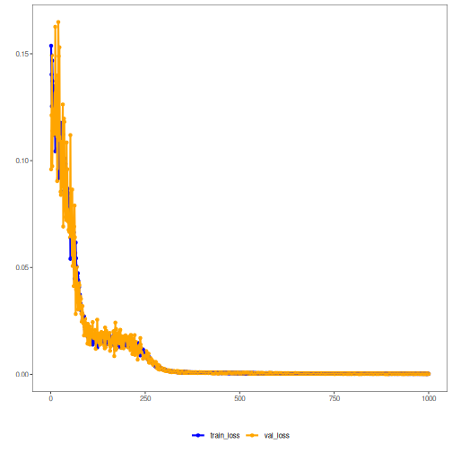

## Convolutional Autoencoder (encode-decode)

1D convolutional layers learn filters that respond to short-term structures in the window, yielding a compressed representation that the decoder expands back to the original dimensionality. Reconstruction error evaluates how well local patterns are preserved.

This example demonstrates how to use a 1D convolutional autoencoder to encode and reconstruct windows from a time series. After reducing from p to k dimensions, the model reconstructs back to p, enabling evaluation of reconstruction error.

Prerequisites
- Python with PyTorch accessible via reticulate
- R packages: daltoolbox, tspredit, daltoolboxdp, ggplot2

Quick notes
- Reconstruction: compare input and output to verify local patterns are preserved.
- Metrics: R2 and MAPE per column help measure quality across window steps.


``` r
# Convolutional Autoencoder transformation (encode-decode)

# Considering a dataset with $p$ numerical attributes. 

# The goal of the autoencoder is to reduce the dimension of $p$ to $k$, such that these $k$ attributes are enough to recompose the original $p$ attributes. However, from the $k$ dimensions the data is returned back to $p$ dimensions. The higher the autoencoder quality, the more similar the output is to the input. 

# Installing packages
#install.packages("tspredit")
#install.packages("daltoolboxdp")
```


``` r
# Loading packages
library(daltoolbox)
library(tspredit)
library(daltoolboxdp)
library(ggplot2)
```


``` r
# Example dataset (series -> windows) 
data(tsd)

sw_size <- 5
ts <- ts_data(tsd$y, sw_size)

ts_head(ts)
```

```
##             t4        t3        t2        t1        t0
## [1,] 0.0000000 0.2474040 0.4794255 0.6816388 0.8414710
## [2,] 0.2474040 0.4794255 0.6816388 0.8414710 0.9489846
## [3,] 0.4794255 0.6816388 0.8414710 0.9489846 0.9974950
## [4,] 0.6816388 0.8414710 0.9489846 0.9974950 0.9839859
## [5,] 0.8414710 0.9489846 0.9974950 0.9839859 0.9092974
## [6,] 0.9489846 0.9974950 0.9839859 0.9092974 0.7780732
```


``` r
# Normalization (min-max by group)
preproc <- ts_norm_gminmax()
preproc <- fit(preproc, ts)
ts <- transform(preproc, ts)

ts_head(ts)
```

```
##             t4        t3        t2        t1        t0
## [1,] 0.5004502 0.6243512 0.7405486 0.8418178 0.9218625
## [2,] 0.6243512 0.7405486 0.8418178 0.9218625 0.9757058
## [3,] 0.7405486 0.8418178 0.9218625 0.9757058 1.0000000
## [4,] 0.8418178 0.9218625 0.9757058 1.0000000 0.9932346
## [5,] 0.9218625 0.9757058 1.0000000 0.9932346 0.9558303
## [6,] 0.9757058 1.0000000 0.9932346 0.9558303 0.8901126
```


``` r
# Train/test split
samp <- ts_sample(ts, test_size = 10)
train <- as.data.frame(samp$train)
test <- as.data.frame(samp$test)
```


``` r
# Training autoencoder (reduce 5 -> 3)
auto <- autoenc_conv_ed(5, 3)
auto <- fit(auto, train)
```


``` r
fit_loss <- data.frame(x=1:length(auto$train_loss), train_loss=auto$train_loss,val_loss=auto$val_loss)

grf <- plot_series(fit_loss, colors=c('Blue','Orange'))
plot(grf)
```




``` r
# Testing the autoencoder
# Show test samples and display reconstruction
print(head(test))
```

```
##          t4        t3        t2        t1        t0
## 1 0.7258342 0.8294719 0.9126527 0.9702046 0.9985496
## 2 0.8294719 0.9126527 0.9702046 0.9985496 0.9959251
## 3 0.9126527 0.9702046 0.9985496 0.9959251 0.9624944
## 4 0.9702046 0.9985496 0.9959251 0.9624944 0.9003360
## 5 0.9985496 0.9959251 0.9624944 0.9003360 0.8133146
## 6 0.9959251 0.9624944 0.9003360 0.8133146 0.7068409
```

``` r
result <- transform(auto, test)
print(head(result))
```

```
## , , 1
## 
##           [,1]      [,2]      [,3]      [,4]      [,5]
## [1,] 0.7356300 0.8425794 0.9171330 0.9552124 0.9647137
## [2,] 0.8537307 0.9137272 0.9532686 0.9669741 0.9642468
## [3,] 0.9250143 0.9485606 0.9653270 0.9641288 0.9494433
## [4,] 0.9560005 0.9610121 0.9650356 0.9481387 0.9143680
## [5,] 0.9676347 0.9616795 0.9516044 0.9063336 0.8347238
## [6,] 0.9656048 0.9493040 0.9123794 0.8157845 0.7078573
```


``` r
# Reconstruction metrics per column: R2 and MAPE
result <- as.data.frame(result)
names(result) <- names(test)
r2 <- c()
mape <- c()
for (col in names(test)){
  r2_col <- cor(test[col], result[col])^2
  r2 <- append(r2, r2_col)
  mape_col <- mean((abs((result[col] - test[col]))/test[col])[[col]])
  mape <- append(mape, mape_col)
  print(paste(col, 'R2 test:', r2_col, 'MAPE:', mape_col))
}
```

```
## [1] "t4 R2 test: 0.978825038247411 MAPE: 0.0173747333859112"
## [1] "t3 R2 test: 0.978521940966112 MAPE: 0.0197810607318538"
## [1] "t2 R2 test: 0.993002051201835 MAPE: 0.0148539498235369"
## [1] "t1 R2 test: 0.997387149437303 MAPE: 0.0139788138649792"
## [1] "t0 R2 test: 0.99647620850809 MAPE: 0.0154797118770425"
```

``` r
print(paste('Means R2 test:', mean(r2), 'MAPE:', mean(mape)))
```

```
## [1] "Means R2 test: 0.98884247767215 MAPE: 0.0162936539366647"
```


``` r
# Note: beware of divisions by values near zero when computing MAPE.
```

References
- Masci, J., Meier, U., Ciresan, D., & Schmidhuber, J. (2011). Stacked Convolutional Auto-Encoders for Hierarchical Feature Extraction. ICANN.
