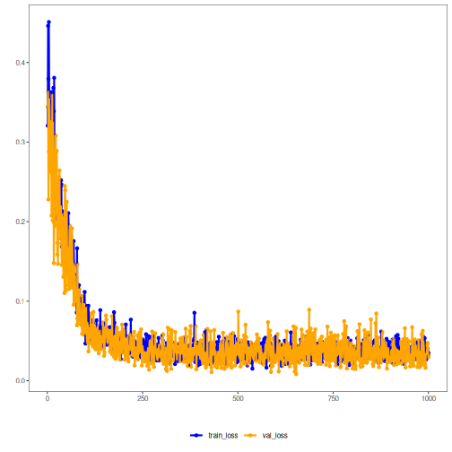

## Denoising Autoencoder (encode-decode)

Inputs are stochastically corrupted during training, and the model learns to reconstruct clean windows. The bottleneck captures noise-invariant structure, and reconstruction metrics quantify how well essential patterns are preserved.

This example demonstrates how to use a denoising autoencoder to encode and reconstruct time-series windows, enabling evaluation of reconstruction quality under noise.

Prerequisites
- Python with PyTorch accessible via reticulate
- R packages: daltoolbox, tspredit, daltoolboxdp, ggplot2

Quick notes
- Noise is applied to the input during training; at inference, the reconstruction tends to be smoother.
- Per-column metrics (R2 and MAPE) help assess robustness per step.


``` r
# Denoising Autoencoder transformation (encode-decode)

# Considering a dataset with $p$ numerical attributes. 

# The goal of the autoencoder is to reduce the dimension of $p$ to $k$, such that these $k$ attributes are enough to recompose the original $p$ attributes. However, from the $k$ dimensions the data is returned back to $p$ dimensions. The higher the autoencoder quality, the more similar the output is to the input. 

# Installing packages
#install.packages("tspredit")
#install.packages("daltoolboxdp")
```


``` r
# Loading packages
library(daltoolbox)
library(tspredit)
library(daltoolboxdp)
library(ggplot2)
```


``` r
# Example dataset (series -> windows) 
data(tsd)

sw_size <- 5
ts <- ts_data(tsd$y, sw_size)

ts_head(ts)
```

```
##             t4        t3        t2        t1        t0
## [1,] 0.0000000 0.2474040 0.4794255 0.6816388 0.8414710
## [2,] 0.2474040 0.4794255 0.6816388 0.8414710 0.9489846
## [3,] 0.4794255 0.6816388 0.8414710 0.9489846 0.9974950
## [4,] 0.6816388 0.8414710 0.9489846 0.9974950 0.9839859
## [5,] 0.8414710 0.9489846 0.9974950 0.9839859 0.9092974
## [6,] 0.9489846 0.9974950 0.9839859 0.9092974 0.7780732
```


``` r
# Normalization (min-max by group)
preproc <- ts_norm_gminmax()
preproc <- fit(preproc, ts)
ts <- transform(preproc, ts)

ts_head(ts)
```

```
##             t4        t3        t2        t1        t0
## [1,] 0.5004502 0.6243512 0.7405486 0.8418178 0.9218625
## [2,] 0.6243512 0.7405486 0.8418178 0.9218625 0.9757058
## [3,] 0.7405486 0.8418178 0.9218625 0.9757058 1.0000000
## [4,] 0.8418178 0.9218625 0.9757058 1.0000000 0.9932346
## [5,] 0.9218625 0.9757058 1.0000000 0.9932346 0.9558303
## [6,] 0.9757058 1.0000000 0.9932346 0.9558303 0.8901126
```


``` r
# Train/test split
samp <- ts_sample(ts, test_size = 10)
train <- as.data.frame(samp$train)
test <- as.data.frame(samp$test)
```


``` r
# Training autoencoder (reduce 5 -> 3)
auto <- autoenc_denoise_ed(5, 3)
auto <- fit(auto, train)
```


``` r
fit_loss <- data.frame(x=1:length(auto$train_loss), train_loss=auto$train_loss,val_loss=auto$val_loss)

grf <- plot_series(fit_loss, colors=c('Blue','Orange'))
plot(grf)
```




``` r
# Testing the autoencoder
# Show test samples and display reconstruction
print(head(test))
```

```
##          t4        t3        t2        t1        t0
## 1 0.7258342 0.8294719 0.9126527 0.9702046 0.9985496
## 2 0.8294719 0.9126527 0.9702046 0.9985496 0.9959251
## 3 0.9126527 0.9702046 0.9985496 0.9959251 0.9624944
## 4 0.9702046 0.9985496 0.9959251 0.9624944 0.9003360
## 5 0.9985496 0.9959251 0.9624944 0.9003360 0.8133146
## 6 0.9959251 0.9624944 0.9003360 0.8133146 0.7068409
```

``` r
result <- transform(auto, test)
print(head(result))
```

```
##           [,1]      [,2]      [,3]      [,4]      [,5]
## [1,] 0.7208251 0.8223514 0.9072489 0.9737244 1.0036175
## [2,] 0.8303562 0.9116808 0.9629100 0.9932957 0.9983439
## [3,] 0.9122012 0.9715783 0.9906166 0.9864898 0.9632626
## [4,] 0.9675057 1.0052432 0.9807797 0.9487506 0.9042947
## [5,] 0.9934543 1.0074228 0.9433823 0.8830273 0.8204177
## [6,] 0.9870230 0.9775023 0.8811744 0.7949731 0.7159251
```


``` r
# Reconstruction metrics per column: R2 and MAPE
result <- as.data.frame(result)
names(result) <- names(test)
r2 <- c()
mape <- c()
for (col in names(test)){
  r2_col <- cor(test[col], result[col])^2
  r2 <- append(r2, r2_col)
  mape_col <- mean((abs((result[col] - test[col]))/test[col])[[col]])
  mape <- append(mape, mape_col)
  print(paste(col, 'R2 test:', r2_col, 'MAPE:', mape_col))
}
```

```
## [1] "t4 R2 test: 0.994204496166708 MAPE: 0.0120082519683035"
## [1] "t3 R2 test: 0.995034137192253 MAPE: 0.0163018120942786"
## [1] "t2 R2 test: 0.999080699740812 MAPE: 0.0120992121173409"
## [1] "t1 R2 test: 0.999336517687 MAPE: 0.0184267948005204"
## [1] "t0 R2 test: 0.999031155042119 MAPE: 0.0225323891228166"
```

``` r
print(paste('Means R2 test:', mean(r2), 'MAPE:', mean(mape)))
```

```
## [1] "Means R2 test: 0.997337401165779 MAPE: 0.016273692020652"
```
 

``` r
# Note: the noise level impacts reconstruction capacity.
```

References
- Vincent, P., Larochelle, H., Bengio, Y., & Manzagol, P. A. (2008). Extracting and composing robust features with denoising autoencoders. ICML.
