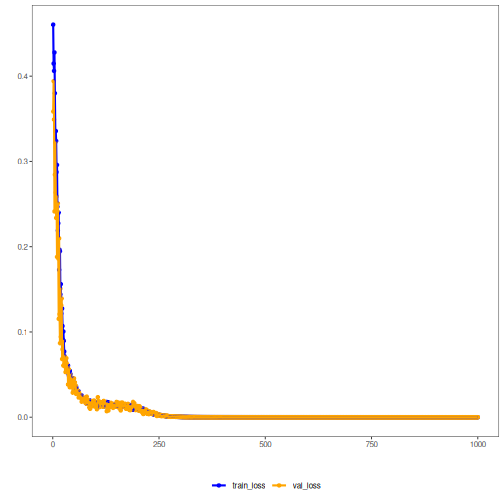

## Autoencoder (Encode) - Overview

A vanilla autoencoder consists of an encoder that maps p-dimensional inputs to a k-dimensional latent code (k < p) and a decoder that reconstructs the input from the code. Training minimizes reconstruction loss (e.g., MSE), and the learned latent codes serve as compact representations.

This example demonstrates how to train a vanilla autoencoder to learn a latent representation (encoding) of a sliding window from a time series. The idea is to reduce the dimensionality from p attributes to k, preserving relevant information. You can use the encoded vectors as input to other tasks (such as clustering or prediction).

Prerequisites
- Reticulate configured and Python with PyTorch installed
- R packages: daltoolbox, tspredit, daltoolboxdp, ggplot2

Steps
1) Prepare the dataset (series windows)
2) Normalize data (avoid unbalanced scales)
3) Split into train and test
4) Train the autoencoder (reduce from 5 to 3 dimensions)
5) Inspect losses and transform data into latent codes


``` r
# Vanilla autoencoder transformation (encode)

# Considering a dataset with $p$ numerical attributes. 

# The goal of the autoencoder is to reduce the dimension of $p$ to $k$, such that these $k$ attributes are enough to recompose the original $p$ attributes. 

# Installing packages
#install.packages("tspredit")
#install.packages("daltoolboxdp")
```


``` r
# Loading required packages
library(daltoolbox)
library(tspredit)
library(daltoolboxdp)
library(ggplot2)
```


``` r
# Example dataset (time series and windows)
data(tsd)

sw_size <- 5
ts <- ts_data(tsd$y, sw_size)

ts_head(ts)
```

```
##             t4        t3        t2        t1        t0
## [1,] 0.0000000 0.2474040 0.4794255 0.6816388 0.8414710
## [2,] 0.2474040 0.4794255 0.6816388 0.8414710 0.9489846
## [3,] 0.4794255 0.6816388 0.8414710 0.9489846 0.9974950
## [4,] 0.6816388 0.8414710 0.9489846 0.9974950 0.9839859
## [5,] 0.8414710 0.9489846 0.9974950 0.9839859 0.9092974
## [6,] 0.9489846 0.9974950 0.9839859 0.9092974 0.7780732
```


``` r
# Normalization (min-max by group) to stabilize training
preproc <- ts_norm_gminmax()
preproc <- fit(preproc, ts)
ts <- transform(preproc, ts)

ts_head(ts)
```

```
##             t4        t3        t2        t1        t0
## [1,] 0.5004502 0.6243512 0.7405486 0.8418178 0.9218625
## [2,] 0.6243512 0.7405486 0.8418178 0.9218625 0.9757058
## [3,] 0.7405486 0.8418178 0.9218625 0.9757058 1.0000000
## [4,] 0.8418178 0.9218625 0.9757058 1.0000000 0.9932346
## [5,] 0.9218625 0.9757058 1.0000000 0.9932346 0.9558303
## [6,] 0.9757058 1.0000000 0.9932346 0.9558303 0.8901126
```


``` r
# Train / test split
samp <- ts_sample(ts, test_size = 10)
train <- as.data.frame(samp$train)
test <- as.data.frame(samp$test)
```


``` r
# Creating and training the autoencoder (reduce from 5 to 3 dimensions)
auto <- autoenc_e(5, 3)
auto <- fit(auto, train)
```


``` r
# Visualizing loss curves (train/validation)
fit_loss <- data.frame(x=1:length(auto$train_loss), train_loss=auto$train_loss,val_loss=auto$val_loss)

grf <- plot_series(fit_loss, colors=c('Blue','Orange'))
plot(grf)
```




``` r
# Testing the autoencoder: encoding test examples
print(head(test))
```

```
##          t4        t3        t2        t1        t0
## 1 0.7258342 0.8294719 0.9126527 0.9702046 0.9985496
## 2 0.8294719 0.9126527 0.9702046 0.9985496 0.9959251
## 3 0.9126527 0.9702046 0.9985496 0.9959251 0.9624944
## 4 0.9702046 0.9985496 0.9959251 0.9624944 0.9003360
## 5 0.9985496 0.9959251 0.9624944 0.9003360 0.8133146
## 6 0.9959251 0.9624944 0.9003360 0.8133146 0.7068409
```

``` r
result <- transform(auto, test)
print(head(result))
```

```
##          [,1]      [,2]       [,3]
## [1,] 1.589304 -1.119577 -0.7208335
## [2,] 1.632516 -1.257932 -0.8321990
## [3,] 1.629551 -1.360621 -0.9252284
## [4,] 1.580592 -1.421259 -0.9941376
## [5,] 1.482376 -1.436338 -1.0344900
## [6,] 1.340540 -1.405640 -1.0439979
```

References
- Hinton, G. E., & Salakhutdinov, R. R. (2006). Reducing the dimensionality of data with neural networks. Science, 313(5786), 504–507.
