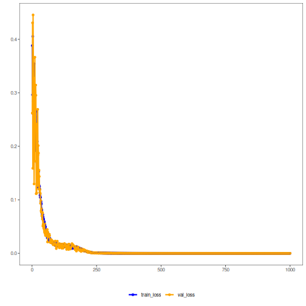

## Autoencoder (Encode-Decode) - Overview

The autoencoder jointly learns an encoder (p → k) and decoder (k → p) by minimizing reconstruction error. With sufficient capacity and regularization, the bottleneck enforces information compression so that reconstructions approximate inputs with low error.

This example shows an autoencoder that encodes and reconstructs the input. After training the reduction from p -> k dimensions, the model decodes back to p. The better the training, the closer the reconstruction is to the original (low reconstruction error).

Prerequisites
- Reticulate configured and Python with PyTorch installed
- R packages: daltoolbox, tspredit, daltoolboxdp, ggplot2

Steps
1) Build time-series windows
2) Normalize data
3) Split into train and test
4) Train the AE (5 -> 3) and track losses
5) Reconstruct and compute metrics (R2, MAPE)


``` r
# Vanilla autoencoder transformation (encode-decode)

# Considering a dataset with $p$ numerical attributes.

# The goal of the autoencoder is to reduce the dimension of $p$ to $k$, such that these $k$ attributes are enough to recompose the original $p$ attributes. However from the $k$ dimensions the data is returned back to $p$ dimensions. The higher the autoencoder quality, the more similar is the output to the input.

# Installing packages
#install.packages("tspredit")
#install.packages("daltoolboxdp")
```


``` r
# Loading packages
library(daltoolbox)
library(tspredit)
library(daltoolboxdp)
library(ggplot2)
```


``` r
# Example dataset (series -> windows)
data(tsd)

sw_size <- 5
ts <- ts_data(tsd$y, sw_size)

ts_head(ts)
```

```
##             t4        t3        t2        t1        t0
## [1,] 0.0000000 0.2474040 0.4794255 0.6816388 0.8414710
## [2,] 0.2474040 0.4794255 0.6816388 0.8414710 0.9489846
## [3,] 0.4794255 0.6816388 0.8414710 0.9489846 0.9974950
## [4,] 0.6816388 0.8414710 0.9489846 0.9974950 0.9839859
## [5,] 0.8414710 0.9489846 0.9974950 0.9839859 0.9092974
## [6,] 0.9489846 0.9974950 0.9839859 0.9092974 0.7780732
```


``` r
# Normalization (min-max by group)
preproc <- ts_norm_gminmax()
preproc <- fit(preproc, ts)
ts <- transform(preproc, ts)

ts_head(ts)
```

```
##             t4        t3        t2        t1        t0
## [1,] 0.5004502 0.6243512 0.7405486 0.8418178 0.9218625
## [2,] 0.6243512 0.7405486 0.8418178 0.9218625 0.9757058
## [3,] 0.7405486 0.8418178 0.9218625 0.9757058 1.0000000
## [4,] 0.8418178 0.9218625 0.9757058 1.0000000 0.9932346
## [5,] 0.9218625 0.9757058 1.0000000 0.9932346 0.9558303
## [6,] 0.9757058 1.0000000 0.9932346 0.9558303 0.8901126
```


``` r
# Train / test split
samp <- ts_sample(ts, test_size = 10)
train <- as.data.frame(samp$train)
test <- as.data.frame(samp$test)
```


``` r
# Training autoencoder (reduction 5 -> 3)
auto <- autoenc_ed(5, 3)
auto <- fit(auto, train)
```


``` r
# Loss curves (train and validation)
fit_loss <- data.frame(x=1:length(auto$train_loss), train_loss=auto$train_loss, val_loss=auto$val_loss)

grf <- plot_series(fit_loss, colors=c('Blue','Orange'))
plot(grf)
```




``` r
# Testing: reconstruction of the test set
print(head(test))
```

```
##          t4        t3        t2        t1        t0
## 1 0.7258342 0.8294719 0.9126527 0.9702046 0.9985496
## 2 0.8294719 0.9126527 0.9702046 0.9985496 0.9959251
## 3 0.9126527 0.9702046 0.9985496 0.9959251 0.9624944
## 4 0.9702046 0.9985496 0.9959251 0.9624944 0.9003360
## 5 0.9985496 0.9959251 0.9624944 0.9003360 0.8133146
## 6 0.9959251 0.9624944 0.9003360 0.8133146 0.7068409
```

``` r
result <- transform(auto, test)
print(head(result))
```

```
##           [,1]      [,2]      [,3]      [,4]      [,5]
## [1,] 0.7256235 0.8310186 0.9118045 0.9702910 0.9955588
## [2,] 0.8291470 0.9134915 0.9688219 0.9978155 0.9944573
## [3,] 0.9104728 0.9708571 0.9977364 0.9974483 0.9633767
## [4,] 0.9690992 0.9996382 0.9955875 0.9637768 0.9007683
## [5,] 0.9992117 0.9972945 0.9629908 0.9008013 0.8132146
## [6,] 0.9949805 0.9610076 0.9004358 0.8121843 0.7078020
```


``` r
# Evaluating reconstruction quality: R2 and MAPE per attribute
result <- as.data.frame(result)
names(result) <- names(test)
r2 <- c()
mape <- c()
for (col in names(test)){
  r2_col <- cor(test[col], result[col])^2
  r2 <- append(r2, r2_col)
  mape_col <- mean((abs((result[col] - test[col]))/test[col])[[col]])
  mape <- append(mape, mape_col)
  print(paste(col, 'R2 test:', r2_col, 'MAPE:', mape_col))
}
```

```
## [1] "t4 R2 test: 0.99994586520953 MAPE: 0.000759415267321361"
## [1] "t3 R2 test: 0.999865674319477 MAPE: 0.00160659466806296"
## [1] "t2 R2 test: 0.999937864129852 MAPE: 0.00151079499390582"
## [1] "t1 R2 test: 0.999981597536023 MAPE: 0.00106879164866938"
## [1] "t0 R2 test: 0.999923246761579 MAPE: 0.00412429744851531"
```

``` r
print(paste('Means R2 test:', mean(r2), 'MAPE:', mean(mape)))
```

```
## [1] "Means R2 test: 0.999930849591292 MAPE: 0.00181397880529496"
```

References
- Goodfellow, I., Bengio, Y., & Courville, A. (2016). Deep Learning. MIT Press. (Chapter on Autoencoders)
