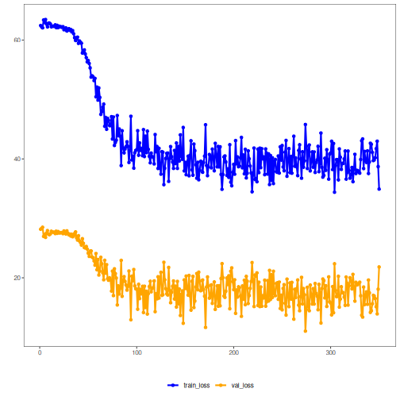

## Variational Autoencoder (encode-decode)

The VAE uses an encoder to parameterize a latent distribution and a decoder to reconstruct inputs from latent samples. Training optimizes an evidence lower bound with reconstruction and KL divergence terms, shaping a smooth, regularized latent space.

This example uses a Variational Autoencoder (VAE) to encode windows of a time series (p -> k) and reconstruct them (k -> p). We evaluate reconstruction quality at the end.

Prerequisites
- Python with PyTorch accessible via reticulate
- R packages: daltoolbox, tspredit, daltoolboxdp, ggplot2


``` r
# Installing example dependencies (if needed)
#install.packages("tspredit")
#install.packages("daltoolboxdp")
```


``` r
# Loading required packages
library(daltoolbox)
library(tspredit)
library(daltoolboxdp)
library(ggplot2)
```


``` r
# Example dataset (series -> windows)
data(tsd)

sw_size <- 5                      # sliding window size (p)
ts <- ts_data(tsd$y, sw_size)     # convert series into windows with p columns

ts_head(ts)
```

```
##             t4        t3        t2        t1        t0
## [1,] 0.0000000 0.2474040 0.4794255 0.6816388 0.8414710
## [2,] 0.2474040 0.4794255 0.6816388 0.8414710 0.9489846
## [3,] 0.4794255 0.6816388 0.8414710 0.9489846 0.9974950
## [4,] 0.6816388 0.8414710 0.9489846 0.9974950 0.9839859
## [5,] 0.8414710 0.9489846 0.9974950 0.9839859 0.9092974
## [6,] 0.9489846 0.9974950 0.9839859 0.9092974 0.7780732
```


``` r
# Normalization (min-max by group)
preproc <- ts_norm_gminmax()
preproc <- fit(preproc, ts)
ts <- transform(preproc, ts)

ts_head(ts)
```

```
##             t4        t3        t2        t1        t0
## [1,] 0.5004502 0.6243512 0.7405486 0.8418178 0.9218625
## [2,] 0.6243512 0.7405486 0.8418178 0.9218625 0.9757058
## [3,] 0.7405486 0.8418178 0.9218625 0.9757058 1.0000000
## [4,] 0.8418178 0.9218625 0.9757058 1.0000000 0.9932346
## [5,] 0.9218625 0.9757058 1.0000000 0.9932346 0.9558303
## [6,] 0.9757058 1.0000000 0.9932346 0.9558303 0.8901126
```


``` r
# Train/test split
samp <- ts_sample(ts, test_size = 10)
train <- as.data.frame(samp$train)
test  <- as.data.frame(samp$test)
```


``` r
# Creating the VAE (encode-decode): 5 -> 3 -> 5 dimensions
auto <- autoenc_variational_ed(5, 3, num_epochs = 350)

# Training the model
auto <- fit(auto, train)
```


``` r
# Learning curves (total loss per epoch)
fit_loss <- data.frame(
  x = 1:length(auto$train_loss),
  train_loss = auto$train_loss,
  val_loss = auto$val_loss
)
grf <- plot_series(fit_loss, colors = c('Blue', 'Orange'))
plot(grf)
```




``` r
# Testing the VAE (reconstruction)
# Show samples from the test set and the reconstruction (p columns)
print(head(test))
```

```
##          t4        t3        t2        t1        t0
## 1 0.7258342 0.8294719 0.9126527 0.9702046 0.9985496
## 2 0.8294719 0.9126527 0.9702046 0.9985496 0.9959251
## 3 0.9126527 0.9702046 0.9985496 0.9959251 0.9624944
## 4 0.9702046 0.9985496 0.9959251 0.9624944 0.9003360
## 5 0.9985496 0.9959251 0.9624944 0.9003360 0.8133146
## 6 0.9959251 0.9624944 0.9003360 0.8133146 0.7068409
```

``` r
result <- transform(auto, test)
print(head(result))
```

```
##           [,1]      [,2]      [,3]      [,4]      [,5]
## [1,] 0.7273871 0.8360412 0.8982532 0.9257225 0.9332272
## [2,] 0.8813378 0.9306853 0.9508041 0.9548176 0.9478881
## [3,] 0.9134271 0.9437235 0.9540501 0.9508773 0.9353892
## [4,] 0.9419892 0.9537852 0.9527568 0.9357920 0.8990666
## [5,] 0.9441141 0.9451063 0.9325388 0.8938740 0.8209068
## [6,] 0.9395368 0.9299003 0.9017384 0.8328269 0.7170894
```


``` r
# Reconstruction metrics per column: R2 and MAPE
result <- as.data.frame(result)
names(result) <- names(test)
r2 <- c()
mape <- c()
for (col in names(test)){
  r2_col <- cor(test[col], result[col])^2
  r2 <- append(r2, r2_col)
  mape_col <- mean((abs((result[col] - test[col]))/test[col])[[col]])
  mape <- append(mape, mape_col)
  print(paste(col, 'R2 test:', r2_col, 'MAPE:', mape_col))
}
```

```
## [1] "t4 R2 test: 0.904102369359475 MAPE: 0.033470008911909"
## [1] "t3 R2 test: 0.958714670359249 MAPE: 0.0325813242621248"
## [1] "t2 R2 test: 0.97938104215965 MAPE: 0.0386187091830129"
## [1] "t1 R2 test: 0.988504814276993 MAPE: 0.0558830752759185"
## [1] "t0 R2 test: 0.991355066890701 MAPE: 0.0721981537985258"
```

``` r
print(paste('Means R2 test:', mean(r2), 'MAPE:', mean(mape)))
```

```
## [1] "Means R2 test: 0.964411592609214 MAPE: 0.0465502542862982"
```

References
- Kingma, D. P., & Welling, M. (2014). Auto-Encoding Variational Bayes. ICLR.
