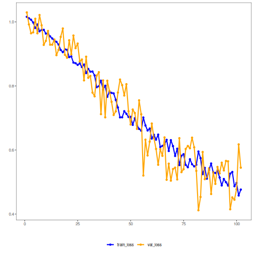

## 08. PyTorch MLP Classifier with Dynamic Validation and Patience

This example focuses on the training regime rather than only the network architecture. It shows how to train the PyTorch-backed MLP classifier with a dynamic validation split and patience-based early stopping.

Prerequisites
- R packages: daltoolbox, daltoolboxdp
- Python with PyTorch accessible via reticulate


``` r
source(url("https://raw.githubusercontent.com/cefet-rj-dal/daltoolboxdp/main/examples/seed.R"))
# Installation (if needed)
#install.packages("daltoolboxdp")
```


``` r
library(daltoolbox)
library(daltoolboxdp)
```


``` r
# Loading Iris dataset
iris <- datasets::iris
```


``` r
# Train/test split
slevels <- levels(iris$Species)

set.seed(1)
sr <- sample_random()
sr <- train_test(sr, iris)
iris_train <- sr$train
iris_test <- sr$test
```


``` r
# Dynamic validation with patience-based early stopping
model <- torch_cla_mlp(
  attribute = "Species",
  slevels = slevels,
  input_size = 4L,
  hidden_sizes = c(16L, 8L),
  num_classes = 3L,
  epochs = 300L,
  validation_strategy = "dynamic",
  stopping_rule = "patience",
  patience = 20L,
  val_ratio = 0.2
)

set_example_seed()
model <- fit(model, iris_train)
```

Training configuration
- `validation_strategy = "dynamic"` redraws the train/validation split at each epoch.
- `stopping_rule = "patience"` stops training after a chosen number of epochs without meaningful validation improvement.
- `epochs = 300L` is an upper bound here; the effective number of epochs is controlled by early stopping.


``` r
# Training evaluation
train_prediction <- predict(model, iris_train)
head(train_prediction)
```

```
##       setosa versicolor  virginica
## 1 0.10695051 0.37456807 0.51848143
## 2 0.02304006 0.34351370 0.63344622
## 3 0.80785841 0.09845348 0.09368815
## 4 0.80818331 0.09828376 0.09353290
## 5 0.08064344 0.36132410 0.55803245
## 6 0.06654857 0.37768784 0.55576360
```

``` r
train_eval <- evaluate(model, iris_train[, "Species"], train_prediction)
print(train_eval$metrics)
```

```
##    accuracy TP TN FP FN precision recall sensitivity specificity f1
## 1 0.6833333 39 81  0  0         1      1           1           1  1
```


``` r
# Test evaluation
test_prediction <- predict(model, iris_test)
test_eval <- evaluate(model, iris_test[, "Species"], test_prediction)
print(test_eval$metrics)
```

```
##   accuracy TP TN FP FN precision recall sensitivity specificity f1
## 1      0.6 11 19  0  0         1      1           1           1  1
```


``` r
# Effective training duration
print(model$epochs_done)
```

```
## [1] 102
```


``` r
# Training and validation curves
fit_loss <- data.frame(
  x = seq_along(model$train_loss_hist),
  train_loss = model$train_loss_hist
)

if (!is.null(model$val_loss_hist) && length(model$val_loss_hist) > 0) {
  fit_loss$val_loss <- model$val_loss_hist
}

colors <- if ("val_loss" %in% names(fit_loss)) c("Blue", "Orange") else c("Blue")
grf <- plot_series(fit_loss, colors = colors)
plot(grf)
```



Notes
- This example is useful when a fixed validation partition feels too brittle on smaller datasets.
- To compare behaviors, keep the same architecture and swap only `stopping_rule` among `"patience"`, `"sma"`, `"ema"`, and `"h"`.
- To return to the default baseline, set `validation_strategy = "static"` and `stopping_rule = "none"`.

References
- Rumelhart, D. E., Hinton, G. E., & Williams, R. J. (1986). Learning representations by back-propagating errors.
- Paszke, A., et al. (2019). PyTorch: An Imperative Style, High-Performance Deep Learning Library.
