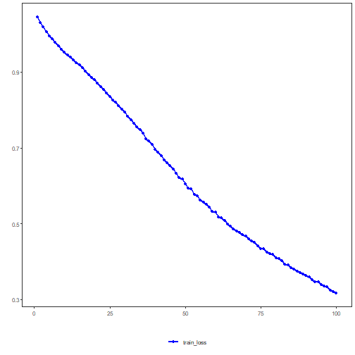

## PyTorch Multi-Layer Perceptron (MLP) Classifier

This example uses the PyTorch-backed MLP classifier exposed by `daltoolboxdp` to classify the Iris dataset. The workflow mirrors the scikit-learn MLP example: split train/test, train, predict, and evaluate.

Prerequisites
- R packages: daltoolbox, daltoolboxdp
- Python with PyTorch accessible via reticulate


``` r
# Installation (if needed)
#install.packages("daltoolboxdp")
```


``` r
library(daltoolbox)
library(daltoolboxdp)
```


``` r
# Loading Iris dataset
iris <- datasets::iris
```


``` r
# Training and evaluation with PyTorch MLP
slevels <- levels(iris$Species)

set.seed(1)
sr <- sample_random()
sr <- train_test(sr, iris)
iris_train <- sr$train
iris_test <- sr$test

model <- torch_cla_mlp(
  attribute = "Species",
  slevels = slevels,
  input_size = 4L,
  hidden_sizes = c(16L, 8L),
  num_classes = 3L,
  epochs = 100L
)

model <- fit(model, iris_train)
train_prediction <- predict(model, iris_train)

iris_train_predictand <- adjust_class_label(iris_train[, "Species"])
train_eval <- evaluate(model, iris_train_predictand, train_prediction)
print(train_eval$metrics)
```

```
##    accuracy TP TN FP FN precision recall sensitivity specificity f1
## 1 0.9666667 39 81  0  0         1      1           1           1  1
```

Constructor configuration
- Fixed-epoch baseline: keep `epochs = 100L`, `validation_strategy = "static"`, and `stopping_rule = "none"`.
- Static early stopping: keep `validation_strategy = "static"` and switch `stopping_rule` to `"patience"`, `"sma"`, `"ema"`, or `"h"`.
- Dynamic early stopping: switch `validation_strategy = "dynamic"` and use the same stopping rules.
- The curve plot below always shows `train_loss_hist`; it adds `val_loss_hist` when validation is active.


``` r
# Test prediction and evaluation
test_prediction <- predict(model, iris_test)

iris_test_predictand <- adjust_class_label(iris_test[, "Species"])
test_eval <- evaluate(model, iris_test_predictand, test_prediction)
print(test_eval$metrics)
```

```
##    accuracy TP TN FP FN precision recall sensitivity specificity f1
## 1 0.9666667 11 19  0  0         1      1           1           1  1
```


``` r
# Training and validation curves
fit_loss <- data.frame(
  x = seq_along(model$train_loss_hist),
  train_loss = model$train_loss_hist
)

if (!is.null(model$val_loss_hist) && length(model$val_loss_hist) > 0) {
  fit_loss$val_loss <- model$val_loss_hist
}

colors <- if ("val_loss" %in% names(fit_loss)) c("Blue", "Orange") else c("Blue")
grf <- plot_series(fit_loss, colors = colors)
plot(grf)
```




``` r
# Predicted probabilities
probabilities <- predict_proba.torch_cla_mlp(model, iris_test[, !names(iris_test) %in% "Species"])
head(probabilities)
```

```
## [[1]]
## [1] 0.906842649 0.084879734 0.008277592
## 
## [[2]]
## [1] 0.942767680 0.053357624 0.003874781
## 
## [[3]]
## [1] 0.933061779 0.062121402 0.004816834
## 
## [[4]]
## [1] 0.904949248 0.086110093 0.008940582
## 
## [[5]]
## [1] 0.951331794 0.045821328 0.002846869
## 
## [[6]]
## [1] 0.955557585 0.042090207 0.002352145
```

Notes
- By default, this example uses `validation_strategy = "static"` and `stopping_rule = "none"`, so only the training curve is shown.
- To enable early stopping, change `stopping_rule` to `"patience"`, `"sma"`, `"ema"`, or `"h"`.
- To switch to the dynamic split, use `validation_strategy = "dynamic"`.

References
- Rumelhart, D. E., Hinton, G. E., & Williams, R. J. (1986). Learning representations by back-propagating errors.
- Paszke, A., et al. (2019). PyTorch: An Imperative Style, High-Performance Deep Learning Library.
