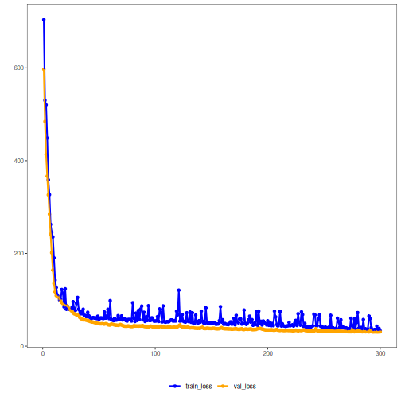

## 02. PyTorch MLP Regressor with Static Validation and Patience

This example emphasizes the training regime of the PyTorch-backed MLP regressor. The architecture is kept simple while validation is held fixed across epochs and early stopping is controlled by patience.

Prerequisites
- R packages: daltoolbox, daltoolboxdp
- Python with PyTorch accessible via reticulate


``` r
source(url("https://raw.githubusercontent.com/cefet-rj-dal/daltoolboxdp/main/examples/seed.R"))
# installation
#install.packages("daltoolboxdp")

library(daltoolbox)
library(daltoolboxdp)
library(MASS)
```


``` r
# Dataset for regression analysis
data(Boston)
Boston <- as.matrix(Boston)
```


``` r
# Train/test split
set.seed(1)
sr <- sample_random()
sr <- train_test(sr, Boston)
boston_train <- sr$train
boston_test <- sr$test
```


``` r
# Static validation with patience-based early stopping
model <- torch_reg_mlp(
  attribute = "medv",
  input_size = sum(colnames(boston_train) != "medv"),
  hidden_sizes = c(16L, 8L),
  epochs = 300L,
  validation_strategy = "static",
  stopping_rule = "patience",
  patience = 20L,
  val_ratio = 0.2
)
set_example_seed()
model <- fit(model, boston_train)
```

Training configuration
- `validation_strategy = "static"` keeps the same validation partition during the whole training run.
- `stopping_rule = "patience"` stops training when the validation loss stops improving for a chosen number of epochs.
- `epochs = 300L` acts as an upper bound; the effective number of epochs is determined by early stopping.
- `input_size` is inferred from the fitted predictors unless you provide it explicitly as a consistency check.


``` r
# Training evaluation
train_prediction <- predict(model, boston_train)
boston_train_predictand <- boston_train[, "medv"]
train_eval <- evaluate(model, boston_train_predictand, train_prediction)
print(train_eval$metrics)
```

```
##        mse     smape        R2
## 1 37.73479 0.1874689 0.5807629
```


``` r
# Test evaluation
test_prediction <- predict(model, boston_test)
boston_test_predictand <- boston_test[, "medv"]
test_eval <- evaluate(model, boston_test_predictand, test_prediction)
print(test_eval$metrics)
```

```
##        mse     smape        R2
## 1 28.74318 0.2097574 0.5223435
```


``` r
# Effective training duration
print(model$epochs_done)
```

```
## [1] 300
```


``` r
# Training and validation curves
fit_loss <- data.frame(
  x = seq_along(model$train_loss_hist),
  train_loss = model$train_loss_hist
)

if (!is.null(model$val_loss_hist) && length(model$val_loss_hist) > 0) {
  fit_loss$val_loss <- model$val_loss_hist
}

colors <- if ("val_loss" %in% names(fit_loss)) c("Blue", "Orange") else c("Blue")
grf <- plot_series(fit_loss, colors = colors)
plot(grf)
```



Notes
- This setup is easier to interpret because all epochs are judged against the same validation subset.
- To compare stopping mechanisms, keep the same architecture and change only `stopping_rule`.

References
- Bishop, C. M. (1995). Neural Networks for Pattern Recognition. Oxford University Press.
- Paszke, A., et al. (2019). PyTorch: An Imperative Style, High-Performance Deep Learning Library.
