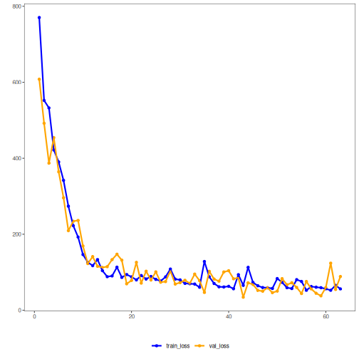

## 03. PyTorch MLP Regressor with Dynamic Validation and Patience

This example keeps the same regression model family but changes the training strategy to dynamic validation. At every epoch, the validation subset is redrawn, which can be useful when the dataset is not large and a single fixed split may be too fragile.

Prerequisites
- R packages: daltoolbox, daltoolboxdp
- Python with PyTorch accessible via reticulate


``` r
source(url("https://raw.githubusercontent.com/cefet-rj-dal/daltoolboxdp/main/examples/seed.R"))
# installation
#install.packages("daltoolboxdp")

library(daltoolbox)
library(daltoolboxdp)
library(MASS)
```


``` r
# Dataset for regression analysis
data(Boston)
Boston <- as.matrix(Boston)
```


``` r
# Train/test split
set.seed(1)
sr <- sample_random()
sr <- train_test(sr, Boston)
boston_train <- sr$train
boston_test <- sr$test
```


``` r
# Dynamic validation with patience-based early stopping
model <- torch_reg_mlp(
  attribute = "medv",
  input_size = sum(colnames(boston_train) != "medv"),
  hidden_sizes = c(16L, 8L),
  epochs = 300L,
  validation_strategy = "dynamic",
  stopping_rule = "patience",
  patience = 20L,
  val_ratio = 0.2
)
set_example_seed()
model <- fit(model, boston_train)
```

Training configuration
- `validation_strategy = "dynamic"` redraws the train/validation split at each epoch.
- `stopping_rule = "patience"` stops training when recent validation values stop improving enough.
- `epochs = 300L` is only the ceiling; the realized length is shown by `epochs_done`.
- `input_size` is inferred from the fitted predictors unless you provide it explicitly as a consistency check.


``` r
# Training evaluation
train_prediction <- predict(model, boston_train)
boston_train_predictand <- boston_train[, "medv"]
train_eval <- evaluate(model, boston_train_predictand, train_prediction)
print(train_eval$metrics)
```

```
##        mse     smape        R2
## 1 68.12717 0.2678577 0.2431007
```


``` r
# Test evaluation
test_prediction <- predict(model, boston_test)
boston_test_predictand <- boston_test[, "medv"]
test_eval <- evaluate(model, boston_test_predictand, test_prediction)
print(test_eval$metrics)
```

```
##        mse     smape        R2
## 1 53.87955 0.2958522 0.1046254
```


``` r
# Effective training duration
print(model$epochs_done)
```

```
## [1] 63
```


``` r
# Training and validation curves
fit_loss <- data.frame(
  x = seq_along(model$train_loss_hist),
  train_loss = model$train_loss_hist
)

if (!is.null(model$val_loss_hist) && length(model$val_loss_hist) > 0) {
  fit_loss$val_loss <- model$val_loss_hist
}

colors <- if ("val_loss" %in% names(fit_loss)) c("Blue", "Orange") else c("Blue")
grf <- plot_series(fit_loss, colors = colors)
plot(grf)
```



Notes
- Dynamic validation can make the monitored curve noisier than the static counterpart.
- The main comparison to make with `02_torch_reg_mlp_static_patience` is whether the training decision becomes more or less stable for your dataset.

References
- Bishop, C. M. (1995). Neural Networks for Pattern Recognition. Oxford University Press.
- Paszke, A., et al. (2019). PyTorch: An Imperative Style, High-Performance Deep Learning Library.
