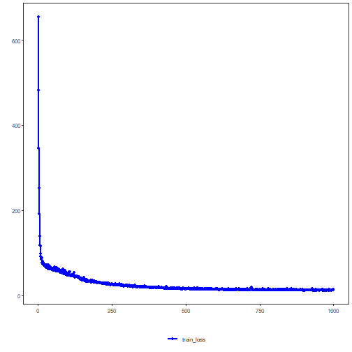

About the method
- `torch_reg_mlp`: PyTorch-backed multilayer perceptron for regression.
- Hyperparameters: `hidden_sizes` (hidden-layer width/depth), `dropout`, `epochs`, `lr`, and the unified validation/early-stopping controls.

Didactic goal: read this example as the same numeric-prediction workflow used by `reg_mlp`. The Experiment Line stays the same; the practical change is the constructor.

Environment setup.

``` r
# Regression MLP with PyTorch

# installation
#install.packages("daltoolboxdp")

# loading DAL
library(daltoolbox)
library(daltoolboxdp)
```

Load Boston dataset (MASS) and inspect types.

``` r
# Dataset for regression analysis

library(MASS)
data(Boston)
print(t(sapply(Boston, class)))
```

```
##      crim      zn        indus     chas      nox       rm        age       dis       rad       tax       ptratio   black     lstat    
## [1,] "numeric" "numeric" "numeric" "integer" "numeric" "numeric" "numeric" "numeric" "integer" "numeric" "numeric" "numeric" "numeric"
##      medv     
## [1,] "numeric"
```

``` r
head(Boston)
```

```
##      crim zn indus chas   nox    rm  age    dis rad tax ptratio  black lstat medv
## 1 0.00632 18  2.31    0 0.538 6.575 65.2 4.0900   1 296    15.3 396.90  4.98 24.0
## 2 0.02731  0  7.07    0 0.469 6.421 78.9 4.9671   2 242    17.8 396.90  9.14 21.6
## 3 0.02729  0  7.07    0 0.469 7.185 61.1 4.9671   2 242    17.8 392.83  4.03 34.7
## 4 0.03237  0  2.18    0 0.458 6.998 45.8 6.0622   3 222    18.7 394.63  2.94 33.4
## 5 0.06905  0  2.18    0 0.458 7.147 54.2 6.0622   3 222    18.7 396.90  5.33 36.2
## 6 0.02985  0  2.18    0 0.458 6.430 58.7 6.0622   3 222    18.7 394.12  5.21 28.7
```

Optional conversion to matrix.

``` r
# for performance, you can convert to matrix
Boston <- as.matrix(Boston)
```

Random and reproducible train/test split.

``` r
# preparing dataset for random sampling
set.seed(1)
sr <- sample_random()
sr <- train_test(sr, Boston)
boston_train <- sr$train
boston_test <- sr$test
```

Train MLP: define the hidden architecture and training controls.

``` r
# Training

model <- torch_reg_mlp(
  attribute = "medv",
  input_size = ncol(Boston) - 1L,
  hidden_sizes = c(16L, 8L),
  epochs = 1000L  
)
model <- fit(model, boston_train)
```

Constructor configuration
- Fixed-epoch baseline: omit `epochs` to use the default value of `100L`, keep `validation_strategy = "static"`, and `stopping_rule = "none"`.
- Static early stopping: keep `validation_strategy = "static"` and choose `stopping_rule = "patience"`, `"sma"`, `"ema"`, or `"h"`.
- Dynamic early stopping: switch `validation_strategy = "dynamic"` and reuse the same stopping rules.
- The curve plot below always shows `train_loss_hist`; it adds `val_loss_hist` when validation is active.

Training evaluation.

``` r
# Model adjustment

train_prediction <- predict(model, boston_train)
boston_train_predictand <- boston_train[, "medv"]
train_eval <- evaluate(model, boston_train_predictand, train_prediction)
print(train_eval$metrics)
```

```
##        mse     smape        R2
## 1 11.91066 0.1250267 0.8676715
```

Test evaluation.

``` r
# Test

test_prediction <- predict(model, boston_test)
boston_test_predictand <- boston_test[, "medv"]
test_eval <- evaluate(model, boston_test_predictand, test_prediction)
print(test_eval$metrics)
```

```
##        mse     smape        R2
## 1 26.05942 0.1511656 0.5669424
```

Training curves.

``` r
# Training and validation curves

fit_loss <- data.frame(
  x = seq_along(model$train_loss_hist),
  train_loss = model$train_loss_hist
)

if (!is.null(model$val_loss_hist) && length(model$val_loss_hist) > 0) {
  fit_loss$val_loss <- model$val_loss_hist
}

colors <- if ("val_loss" %in% names(fit_loss)) c("Blue", "Orange") else c("Blue")
grf <- plot_series(fit_loss, colors = colors)
plot(grf)
```



Notes
- Default configuration uses `validation_strategy = "static"` and `stopping_rule = "none"`, so only the training curve is shown.
- To activate early stopping, set `stopping_rule` to `"patience"`, `"sma"`, `"ema"`, or `"h"`.
- To activate dynamic validation splits, use `validation_strategy = "dynamic"`.

References
- Bishop, C. M. (1995). Neural Networks for Pattern Recognition. Oxford University Press.
- Paszke, A., et al. (2019). PyTorch: An Imperative Style, High-Performance Deep Learning Library.
