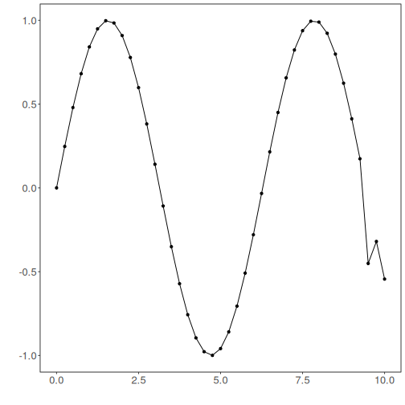

## Time Series Encoding and Reconstruction (encode-decode)

Time series windows of size p are encoded into k-dimensional latent vectors and then decoded back to p dimensions. Training minimizes reconstruction loss so that latent codes capture the essential structure of windows, enabling quality assessment via reconstruction error.

This example shows how to transform a time series into windows (p) and train an autoencoder to encode (p -> k) and reconstruct (k -> p) these windows, allowing evaluation of reconstruction quality.

Prerequisites
- R packages: daltoolbox, ggplot2
- Python with PyTorch accessible via reticulate (backend called internally)


``` r
source(url("https://raw.githubusercontent.com/cefet-rj-dal/daltoolboxdp/main/examples/seed.R"))
# Loading required packages
library(daltoolbox)
```

Series for study


``` r
data(tsd)
tsd$y[39] <- tsd$y[39] * 6   # inject a synthetic outlier for illustration
```


``` r
sw_size <- 5                         # sliding window size (p)
ts <- ts_data(tsd$y, sw_size)        # series -> windows with p columns
ts_head(ts, 3)
```

```
##             t4        t3        t2        t1        t0
## [1,] 0.0000000 0.2474040 0.4794255 0.6816388 0.8414710
## [2,] 0.2474040 0.4794255 0.6816388 0.8414710 0.9489846
## [3,] 0.4794255 0.6816388 0.8414710 0.9489846 0.9974950
```


``` r
library(ggplot2)
plot_ts(x = tsd$x, y = tsd$y) +
  theme(text = element_text(size = 16))
```



Data sampling


``` r
samp <- ts_sample(ts, test_size = 5)
train <- as.data.frame(samp$train)
test  <- as.data.frame(samp$test)
```

Train the model (encode-decode)


``` r
auto <- autoenc_ed(5, 3)             # 5 -> 3 -> 5 dimensions
set_example_seed()
auto <- fit(auto, train)
```

Reconstruction evaluation (train)


``` r
print(head(train))                    # original windows (p columns)
```

```
##          t4        t3        t2        t1        t0
## 1 0.0000000 0.2474040 0.4794255 0.6816388 0.8414710
## 2 0.2474040 0.4794255 0.6816388 0.8414710 0.9489846
## 3 0.4794255 0.6816388 0.8414710 0.9489846 0.9974950
## 4 0.6816388 0.8414710 0.9489846 0.9974950 0.9839859
## 5 0.8414710 0.9489846 0.9974950 0.9839859 0.9092974
## 6 0.9489846 0.9974950 0.9839859 0.9092974 0.7780732
```

``` r
result <- transform(auto, train)      # reconstructed windows (p columns)
print(head(result))
```

```
##           [,1]      [,2]      [,3]      [,4]      [,5]
## [1,] 0.1737699 0.3528315 0.4219284 0.5866906 0.6866236
## [2,] 0.4188232 0.5779814 0.6642898 0.7816799 0.8236263
## [3,] 0.6210196 0.7504283 0.8578256 0.9102328 0.9160316
## [4,] 0.7572393 0.8593854 0.9720352 0.9815363 0.9478498
## [5,] 0.8397456 0.9144131 1.0092331 0.9905427 0.9162860
## [6,] 0.8624422 0.9146932 0.9777943 0.9532256 0.8295609
```

Reconstruction of the test set


``` r
print(head(test))
```

```
##          t4        t3         t2         t1         t0
## 1 0.9893582 0.9226042  0.7984871  0.6247240  0.4121185
## 2 0.9226042 0.7984871  0.6247240  0.4121185  0.1738895
## 3 0.7984871 0.6247240  0.4121185  0.1738895 -0.4509067
## 4 0.6247240 0.4121185  0.1738895 -0.4509067 -0.3195192
## 5 0.4121185 0.1738895 -0.4509067 -0.3195192 -0.5440211
```

``` r
result <- transform(auto, test)
print(head(result))
```

```
##            [,1]       [,2]       [,3]         [,4]        [,5]
## [1,] 0.75561529 0.80974257 0.78036916  0.739842951  0.55398911
## [2,] 0.61527532 0.68745744 0.58861226  0.547835588  0.33978754
## [3,] 0.43230015 0.46701068 0.35987493  0.262289554  0.07695113
## [4,] 0.23522390 0.24550679 0.17915291  0.006133974 -0.12694584
## [5,] 0.05097514 0.04747196 0.03879585 -0.161284864 -0.25191396
```

References
- Goodfellow, I., Bengio, Y., & Courville, A. (2016). Deep Learning. MIT Press. (Chapter on Autoencoders)

