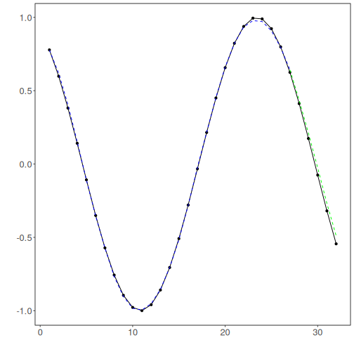
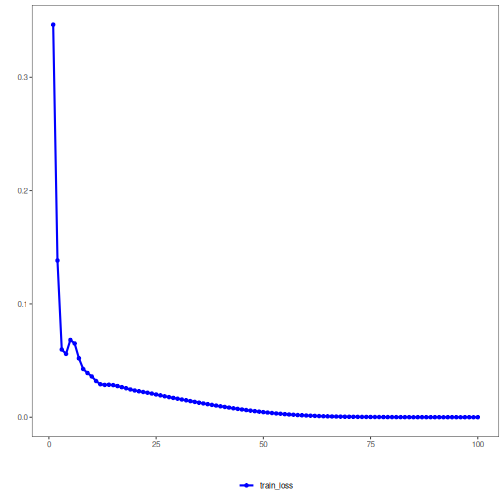

## Conv1D Regression

About the method
- A 1D convolutional network applies learnable filters across the lag window to detect local temporal motifs.
- It is useful when short repeated patterns matter more than long global recurrence alone.

Didactic goal: understand how convolution changes the representation learned from sliding windows, while keeping the same Experiment Line used in `tspredit`.


``` r
source(url("https://raw.githubusercontent.com/cefet-rj-dal/daltoolboxdp/main/examples/seed.R"))
# Time Series Regression - 1D CNN (Conv1D)

# Installing packages (if needed)

#install.packages("daltoolboxdp")
```

We start by loading the packages used throughout this example.


``` r
# Loading the packages
library(daltoolbox)
library(daltoolboxdp)
library(tspredit)
library(ggplot2)
```

We load the example series that will be used throughout the demonstration.


``` r
# Series for study and sliding windows

data(tsd)
ts <- ts_data(tsd$y, 10)
ts_head(ts, 3)
```

```
##             t9        t8        t7        t6        t5        t4        t3        t2        t1        t0
## [1,] 0.0000000 0.2474040 0.4794255 0.6816388 0.8414710 0.9489846 0.9974950 0.9839859 0.9092974 0.7780732
## [2,] 0.2474040 0.4794255 0.6816388 0.8414710 0.9489846 0.9974950 0.9839859 0.9092974 0.7780732 0.5984721
## [3,] 0.4794255 0.6816388 0.8414710 0.9489846 0.9974950 0.9839859 0.9092974 0.7780732 0.5984721 0.3816610
```

Before moving on, we visualize the series so the effect of the next transformation can be compared against the original signal.


``` r
# Series visualization
plot_ts(x = tsd$x, y = tsd$y) + theme(text = element_text(size = 16))
```


We now preserve the time order, split the data into train and test partitions, and project the windows into inputs and targets.


``` r
# Train-test split and projection (X, y)

samp <- ts_sample(ts, test_size = 5)
io_train <- ts_projection(samp$train)
io_test <- ts_projection(samp$test)
```

This step trains the Conv1D model.


``` r
# Training the Conv1D model

model <- ts_conv1d(ts_norm_gminmax(), input_size = 4)
set_example_seed()
model <- fit(model, x = io_train$input, y = io_train$output)
```

Constructor configuration
- Fixed-epoch baseline: omit `epochs` to use the default value, keep `validation_strategy = "static"`, and `stopping_rule = "none"`.
- Static early stopping: keep `validation_strategy = "static"` and choose `stopping_rule = "patience"`, `"sma"`, `"ema"`, or `"h"`.
- Dynamic early stopping: switch `validation_strategy = "dynamic"` and reuse the same stopping rules.
- The final curve plot always shows `train_loss_hist`; it adds `val_loss_hist` when validation is active.

Architecture variations
- `in_channels` and `sequence_length` control how each row is reshaped before the convolution.
- `conv_channels`, `kernel_sizes`, and `strides` define the convolutional stack.
- `pooling` and `dense_hidden_sizes` control feature aggregation and the regression head.

We first evaluate the in-sample fit so the model adjustment can be compared with the later forecast.


``` r
# Fit evaluation (train)

adjust <- predict(model, io_train$input)
adjust <- as.vector(adjust)
output <- as.vector(io_train$output)
ev_adjust <- evaluate(model, output, adjust)
ev_adjust$mse
```

```
## [1] 0.0001007099
```

We now forecast the test set and compare the predicted values with the observed ones.


``` r
# Forecast on test set

prediction <- predict(model, x = io_test$input[1, ], steps_ahead = 5)
prediction <- as.vector(prediction)
output <- as.vector(io_test$output)
ev_test <- evaluate(model, output, prediction)
ev_test
```

```
## $values
## [1]  0.41211849  0.17388949 -0.07515112 -0.31951919 -0.54402111
## 
## $prediction
## [1]  0.43476895  0.21081667 -0.02554476 -0.26861302 -0.48919488
## 
## $smape
## [1] 0.3019954
## 
## $mse
## [1] 0.001986961
## 
## $R2
## [1] 0.9828385
## 
## $metrics
##           mse     smape        R2
## 1 0.001986961 0.3019954 0.9828385
```

This final plot summarizes the result of the transformation so the effect can be interpreted visually.


``` r
# Plot results

yvalues <- c(io_train$output, io_test$output)
plot_ts_pred(y = yvalues, yadj = adjust, ypre = prediction) + theme(text = element_text(size = 16))
```



The additional plot below shows the training curve and, when enabled, the validation curve used by the unified early-stopping strategies.


``` r
# Training and validation curves

fit_loss <- data.frame(
  x = seq_along(model$train_loss_hist),
  train_loss = model$train_loss_hist
)

if (!is.null(model$val_loss_hist) && length(model$val_loss_hist) > 0) {
  fit_loss$val_loss <- model$val_loss_hist
}

colors <- if ("val_loss" %in% names(fit_loss)) c("Blue", "Orange") else c("Blue")
grf <- plot_series(fit_loss, colors = colors)
plot(grf)
```



Notes
- The default configuration is `validation_strategy = "static"` and `stopping_rule = "none"`, so only the training curve is shown.
- To display validation loss as well, use an early-stopping rule such as `"patience"`, `"sma"`, `"ema"`, or `"h"`.
- To combine dynamic validation with those criteria, set `validation_strategy = "dynamic"`.

References
- Y. LeCun, L. Bottou, Y. Bengio, and P. Haffner (1998). Gradient-based learning applied to document recognition. Proceedings of the IEEE, 86(11), 2278–2324.
