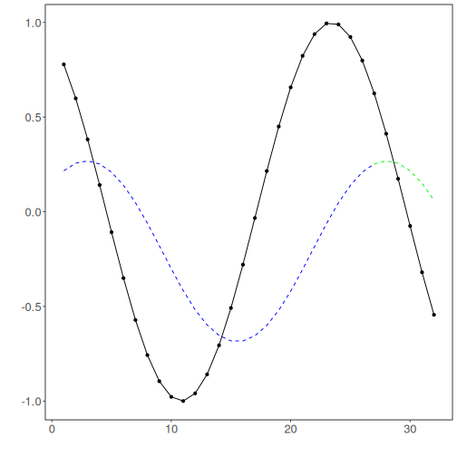
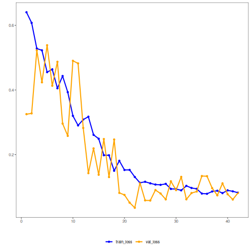

## 22. LSTM Regression with Dynamic Validation and Patience

About the method
- LSTM networks are recurrent models designed to retain and update information across ordered inputs.
- They are useful when forecasting depends on sequential dependencies that may span more than a few immediate lags.

Didactic goal: compare a recurrent sequence model with the feedforward and convolutional alternatives, while preserving the same Experiment Line used in `tspredit`.


``` r
source(url("https://raw.githubusercontent.com/cefet-rj-dal/daltoolboxdp/main/examples/seed.R"))
# Time Series Regression - LSTM

# Installing packages (if needed)

#install.packages("daltoolboxdp")
```

We start by loading the packages used throughout this example.


``` r
# Loading the packages
library(daltoolbox)
library(daltoolboxdp)
library(tspredit)
library(ggplot2)
```

We load the example series that will be used throughout the demonstration.


``` r
# Series for study and sliding windows

data(tsd)
ts <- ts_data(tsd$y, 10)
ts_head(ts, 3)
```

```
##             t9        t8        t7        t6        t5        t4        t3        t2        t1        t0
## [1,] 0.0000000 0.2474040 0.4794255 0.6816388 0.8414710 0.9489846 0.9974950 0.9839859 0.9092974 0.7780732
## [2,] 0.2474040 0.4794255 0.6816388 0.8414710 0.9489846 0.9974950 0.9839859 0.9092974 0.7780732 0.5984721
## [3,] 0.4794255 0.6816388 0.8414710 0.9489846 0.9974950 0.9839859 0.9092974 0.7780732 0.5984721 0.3816610
```

Before moving on, we visualize the series so the effect of the next transformation can be compared against the original signal.


``` r
# Series visualization
plot_ts(x = tsd$x, y = tsd$y) + theme(text = element_text(size = 16))
```


We now preserve the time order, split the data into train and test partitions, and project the windows into inputs and targets.


``` r
# Train-test split and projection (X, y)

samp <- ts_sample(ts, test_size = 5)
io_train <- ts_projection(samp$train)
io_test <- ts_projection(samp$test)
```

We now train the LSTM model with dynamic validation and patience-based early stopping.


``` r
# Training the LSTM model

model <- ts_lstm(
  ts_norm_gminmax(),
  input_size = 9,
  sequence_length = 3L,
  hidden_size = 16L,
  epochs = 300L,
  validation_strategy = "dynamic",
  stopping_rule = "patience",
  patience = 20L
)
set_example_seed()
model <- fit(model, x = io_train$input, y = io_train$output)
```

Constructor configuration
- `validation_strategy = "dynamic"` redraws the train/validation split at each epoch.
- `stopping_rule = "patience"` stops training when the monitored validation loss stops improving enough.
- `epochs = 300L` is only a ceiling; the actual number of epochs is reported by `epochs_done`.
- The final curve plot shows both `train_loss_hist` and `val_loss_hist`, which can be noisier than in the static case.

Architecture variations
- `sequence_length` converts each row into a true multistep sequence instead of a single recurrent step.
- `hidden_size`, `num_layers`, `dropout`, and `bidirectional` change the recurrent backbone.
- `mlp_hidden_sizes` adds a dense head after the final recurrent state.
- In this example, `input_size = 9` matches the nine lagged predictors produced by `ts_projection()`, and `sequence_length = 3L` turns them into three temporal steps with three features each.
- This setup is useful when a single fixed validation split feels too brittle for the available data.

We first evaluate the in-sample fit so the model adjustment can be compared with the later forecast.


``` r
# Fit evaluation (train)

adjust <- predict(model, io_train$input)
adjust <- as.vector(adjust)
output <- as.vector(io_train$output)
ev_adjust <- evaluate(model, output, adjust)
ev_adjust$mse
```

```
## [1] 0.4524872
```

We now forecast the test set and compare the predicted values with the observed ones.


``` r
# Forecast on test set

steps_ahead <- 1
prediction <- predict(model, x = io_test$input, steps_ahead = steps_ahead)
prediction <- as.vector(prediction)

output <- as.vector(io_test$output)
if (steps_ahead > 1)
  output <- output[1:steps_ahead]

print(sprintf("%.2f, %.2f", output, prediction))
```

```
## [1] "0.41, 0.27"  "0.17, 0.26"  "-0.08, 0.22" "-0.32, 0.15" "-0.54, 0.06"
```

This chunk evaluates the custom component on the held-out test segment.


``` r
# Test evaluation

ev_test <- evaluate(model, output, prediction)
print(head(ev_test$metrics))
```

```
##         mse    smape         R2
## 1 0.1397182 1.360763 -0.2067533
```

``` r
print(sprintf("smape: %.2f", 100 * ev_test$metrics$smape))
```

```
## [1] "smape: 136.08"
```

This final plot summarizes the result of the transformation so the effect can be interpreted visually.


``` r
# Plot results

yvalues <- c(io_train$output, io_test$output)
plot_ts_pred(y = yvalues, yadj = adjust, ypre = prediction) + theme(text = element_text(size = 16))
```



The additional plot below shows the training curve and, when enabled, the validation curve used by the unified early-stopping strategies.


``` r
# Training and validation curves

fit_loss <- data.frame(
  x = seq_along(model$train_loss_hist),
  train_loss = model$train_loss_hist
)

if (!is.null(model$val_loss_hist) && length(model$val_loss_hist) > 0) {
  fit_loss$val_loss <- model$val_loss_hist
}

colors <- if ("val_loss" %in% names(fit_loss)) c("Blue", "Orange") else c("Blue")
grf <- plot_series(fit_loss, colors = colors)
plot(grf)
```




``` r
# Effective training duration
print(model$epochs_done)
```

```
## [1] 42
```

Notes
- Dynamic validation makes the monitored curve more variable, but can reduce dependence on a single holdout draw.
- To compare with a fixed validation split, see `21_ts_lstm_static_patience`.

References
- S. Hochreiter and J. Schmidhuber (1997). Long short-term memory. Neural Computation, 9(8), 1735–1780.
