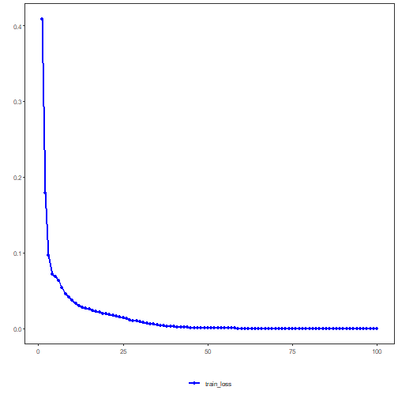

## Time Series Forecasting with Conv1D

This example shows how to use the PyTorch-backed `ts_conv1d` forecaster with sliding windows from `tspredit`. The model uses 1D convolutions over the lag window to learn local temporal patterns before the final prediction.

Prerequisites
- R packages: daltoolbox, tspredit, daltoolboxdp, ggplot2
- Python with PyTorch accessible via reticulate


``` r
library(daltoolbox)
library(tspredit)
library(daltoolboxdp)
library(ggplot2)
```


``` r
data(tsd)

sw_size <- 5
ts <- data.frame(unclass(ts_data(tsd$y, sw_size)))

split_at <- nrow(ts) - 5
train <- ts[1:split_at, ]
test <- ts[(split_at + 1):nrow(ts), ]
```


``` r
model <- ts_conv1d(
  preprocess = ts_norm_gminmax(),
  input_size = 4L,
  epochs = 100L
)

model <- fit(model, train[, 1:4], train[, 5])
```


``` r
# Training curves
fit_loss <- data.frame(
  x = seq_along(model$train_loss_hist),
  train_loss = model$train_loss_hist
)
if (!is.null(model$val_loss_hist) && length(model$val_loss_hist) > 0) {
  fit_loss$val_loss <- model$val_loss_hist
}

colors <- if ("val_loss" %in% names(fit_loss)) c("Blue", "Orange") else c("Blue")
grf <- plot_series(fit_loss, colors = colors)
plot(grf)
```




``` r
# One-step-ahead prediction on the test windows
prediction <- predict(model, test[, 1:4])
print(prediction)
```

```
## [1]  0.41001562  0.16947048 -0.07644035 -0.31325250 -0.55243968
```

Notes
- The default configuration is `validation_strategy = "static"` and `stopping_rule = "none"`, so only the training curve is shown.
- To include validation loss, choose an early-stopping rule such as `"patience"`, `"sma"`, `"ema"`, or `"h"`.

References
- LeCun, Y., Bengio, Y., & Hinton, G. (2015). Deep learning.
