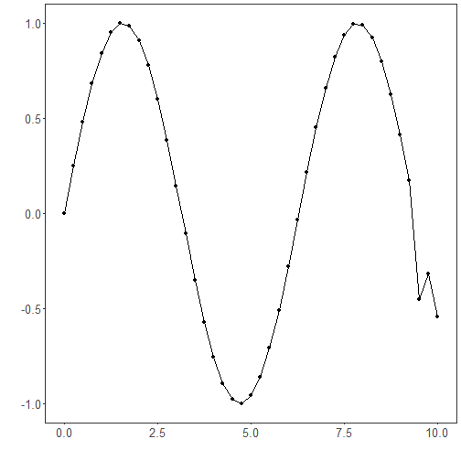

## Time Series Encoding and Reconstruction (encode-decode)

Time series windows of size p are encoded into k-dimensional latent vectors and then decoded back to p dimensions. Training minimizes reconstruction loss so that latent codes capture the essential structure of windows, enabling quality assessment via reconstruction error.

This example shows how to transform a time series into windows (p) and train an autoencoder to encode (p -> k) and reconstruct (k -> p) these windows, allowing evaluation of reconstruction quality.

Prerequisites
- R packages: daltoolbox, ggplot2
- Python with PyTorch accessible via reticulate (backend called internally)


``` r
# Loading required packages
library(daltoolbox)
```

Series for study


``` r
data(tsd)
tsd$y[39] <- tsd$y[39] * 6   # inject a synthetic outlier for illustration
```


``` r
sw_size <- 5                         # sliding window size (p)
ts <- ts_data(tsd$y, sw_size)        # series -> windows with p columns
ts_head(ts, 3)
```

```
##             t4        t3        t2        t1        t0
## [1,] 0.0000000 0.2474040 0.4794255 0.6816388 0.8414710
## [2,] 0.2474040 0.4794255 0.6816388 0.8414710 0.9489846
## [3,] 0.4794255 0.6816388 0.8414710 0.9489846 0.9974950
```


``` r
library(ggplot2)
plot_ts(x = tsd$x, y = tsd$y) +
  theme(text = element_text(size = 16))
```



Data sampling


``` r
samp <- ts_sample(ts, test_size = 5)
train <- as.data.frame(samp$train)
test  <- as.data.frame(samp$test)
```

Train the model (encode-decode)


``` r
auto <- autoenc_ed(5, 3)             # 5 -> 3 -> 5 dimensions
auto <- fit(auto, train)
```

Reconstruction evaluation (train)


``` r
print(head(train))                    # original windows (p columns)
```

```
##          t4        t3        t2        t1        t0
## 1 0.0000000 0.2474040 0.4794255 0.6816388 0.8414710
## 2 0.2474040 0.4794255 0.6816388 0.8414710 0.9489846
## 3 0.4794255 0.6816388 0.8414710 0.9489846 0.9974950
## 4 0.6816388 0.8414710 0.9489846 0.9974950 0.9839859
## 5 0.8414710 0.9489846 0.9974950 0.9839859 0.9092974
## 6 0.9489846 0.9974950 0.9839859 0.9092974 0.7780732
```

``` r
result <- transform(auto, train)      # reconstructed windows (p columns)
print(head(result))
```

```
##              [,1]      [,2]      [,3]      [,4]      [,5]
## [1,] -0.006120995 0.2424180 0.4768801 0.6841679 0.8424887
## [2,]  0.250115812 0.4736085 0.6770015 0.8432962 0.9463313
## [3,]  0.479762077 0.6822408 0.8387935 0.9489290 0.9958119
## [4,]  0.678632319 0.8461254 0.9553511 0.9934016 0.9835557
## [5,]  0.840891719 0.9507427 0.9990957 0.9874523 0.9098583
## [6,]  0.948559463 0.9944462 0.9781361 0.9109046 0.7770039
```

Reconstruction of the test set


``` r
print(head(test))
```

```
##          t4        t3         t2         t1         t0
## 1 0.9893582 0.9226042  0.7984871  0.6247240  0.4121185
## 2 0.9226042 0.7984871  0.6247240  0.4121185  0.1738895
## 3 0.7984871 0.6247240  0.4121185  0.1738895 -0.4509067
## 4 0.6247240 0.4121185  0.1738895 -0.4509067 -0.3195192
## 5 0.4121185 0.1738895 -0.4509067 -0.3195192 -0.5440211
```

``` r
result <- transform(auto, test)
print(head(result))
```

```
##           [,1]       [,2]       [,3]        [,4]       [,5]
## [1,] 0.9940729 0.92773902  0.8021326  0.62477839  0.4192129
## [2,] 0.9247325 0.80211580  0.6362441  0.41214308  0.1663702
## [3,] 0.8362039 0.59421229  0.3342319  0.08172398 -0.2320676
## [4,] 0.6036069 0.38836125  0.1341495 -0.11223931 -0.3651834
## [5,] 0.3031124 0.03253341 -0.2169000 -0.45332751 -0.6410513
```

References
- Goodfellow, I., Bengio, Y., & Courville, A. (2016). Deep Learning. MIT Press. (Chapter on Autoencoders)

