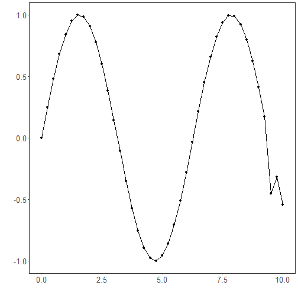

## Time Series Encoding (encode)

We use a sliding-window embedding to convert a univariate series into fixed-length vectors of length p. A feed-forward autoencoder is trained to minimize reconstruction error, and its bottleneck (k < p) provides a compact encoding that preserves salient information for downstream tasks.

This example shows how to transform a time series into fixed-size windows and train an autoencoder to learn a compact latent representation (p -> k) of these windows.

Prerequisites
- R packages: daltoolbox, ggplot2
- Python with PyTorch accessible via reticulate (the backend is loaded by internal functions)


``` r
# Loading required packages
library(daltoolbox)
```

Series for study


``` r
data(tsd)
tsd$y[39] <- tsd$y[39] * 6   # inject a synthetic outlier for illustration in the plot
```


``` r
sw_size <- 5                         # sliding window size (p)
ts <- ts_data(tsd$y, sw_size)        # convert the series into windows with p columns
ts_head(ts, 3)                       # view the first 3 windows
```

```
##             t4        t3        t2        t1        t0
## [1,] 0.0000000 0.2474040 0.4794255 0.6816388 0.8414710
## [2,] 0.2474040 0.4794255 0.6816388 0.8414710 0.9489846
## [3,] 0.4794255 0.6816388 0.8414710 0.9489846 0.9974950
```


``` r
library(ggplot2)
plot_ts(x = tsd$x, y = tsd$y) +      # series plot with the outlier peak
  theme(text = element_text(size = 16))
```



Data sampling


``` r
samp <- ts_sample(ts, test_size = 5) # hold out the last 5 windows for test
train <- as.data.frame(samp$train)
test  <- as.data.frame(samp$test)
```

Train the model


``` r
auto <- autoenc_e(5, 3)              # reduce from 5 -> 3 dimensions (p -> k)
auto <- fit(auto, train)
```

Encoding evaluation (train)


``` r
print(head(train))                    # original windows (p columns)
```

```
##          t4        t3        t2        t1        t0
## 1 0.0000000 0.2474040 0.4794255 0.6816388 0.8414710
## 2 0.2474040 0.4794255 0.6816388 0.8414710 0.9489846
## 3 0.4794255 0.6816388 0.8414710 0.9489846 0.9974950
## 4 0.6816388 0.8414710 0.9489846 0.9974950 0.9839859
## 5 0.8414710 0.9489846 0.9974950 0.9839859 0.9092974
## 6 0.9489846 0.9974950 0.9839859 0.9092974 0.7780732
```

``` r
result <- transform(auto, train)      # encodings (k columns)
print(head(result))
```

```
##           [,1]       [,2]      [,3]
## [1,] 0.3098324 -0.7721804 -1.017501
## [2,] 0.6671491 -0.9288521 -1.247084
## [3,] 0.9890245 -1.0318518 -1.419328
## [4,] 1.2391351 -1.0664270 -1.511156
## [5,] 1.4094226 -1.0301460 -1.517216
## [6,] 1.5018377 -0.9352230 -1.444262
```

Encoding of the test set


``` r
print(head(test))
```

```
##          t4        t3         t2         t1         t0
## 1 0.9893582 0.9226042  0.7984871  0.6247240  0.4121185
## 2 0.9226042 0.7984871  0.6247240  0.4121185  0.1738895
## 3 0.7984871 0.6247240  0.4121185  0.1738895 -0.4509067
## 4 0.6247240 0.4121185  0.1738895 -0.4509067 -0.3195192
## 5 0.4121185 0.1738895 -0.4509067 -0.3195192 -0.5440211
```

``` r
result <- transform(auto, test)
print(head(result))
```

```
##           [,1]         [,2]        [,3]
## [1,] 1.4618663 -0.605606973 -1.11110997
## [2,] 1.3244340 -0.378101081 -0.84604269
## [3,] 1.1042303  0.009509986 -0.31229371
## [4,] 0.8148295  0.225497171  0.02565201
## [5,] 0.4817981  0.354776531  0.39907908
```

References
- Goodfellow, I., Bengio, Y., & Courville, A. (2016). Deep Learning. MIT Press. (Chapter on Autoencoders)
